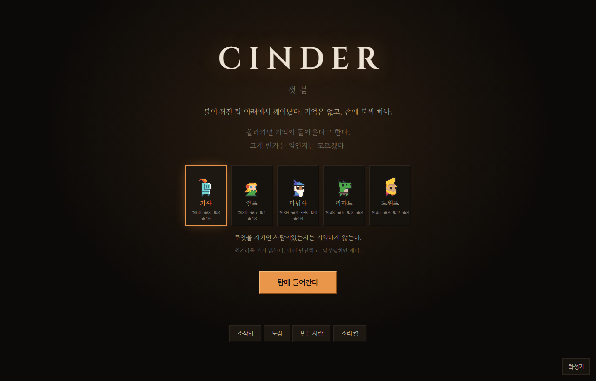
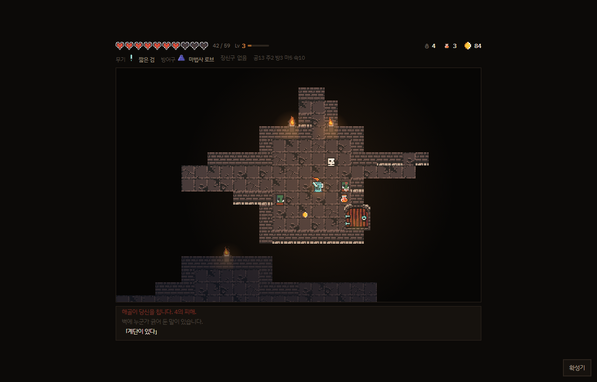
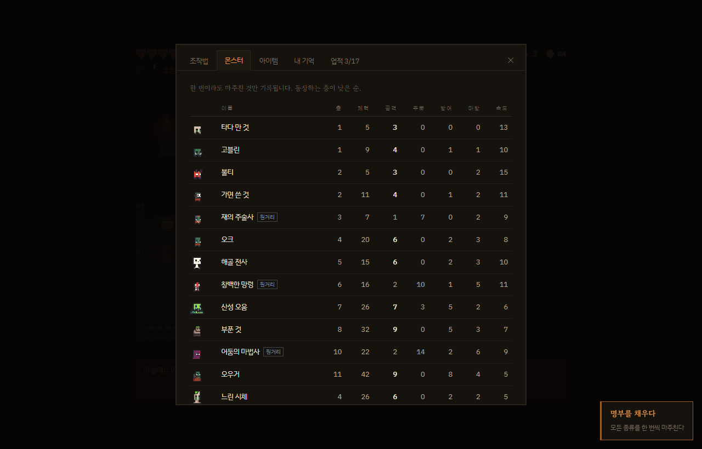
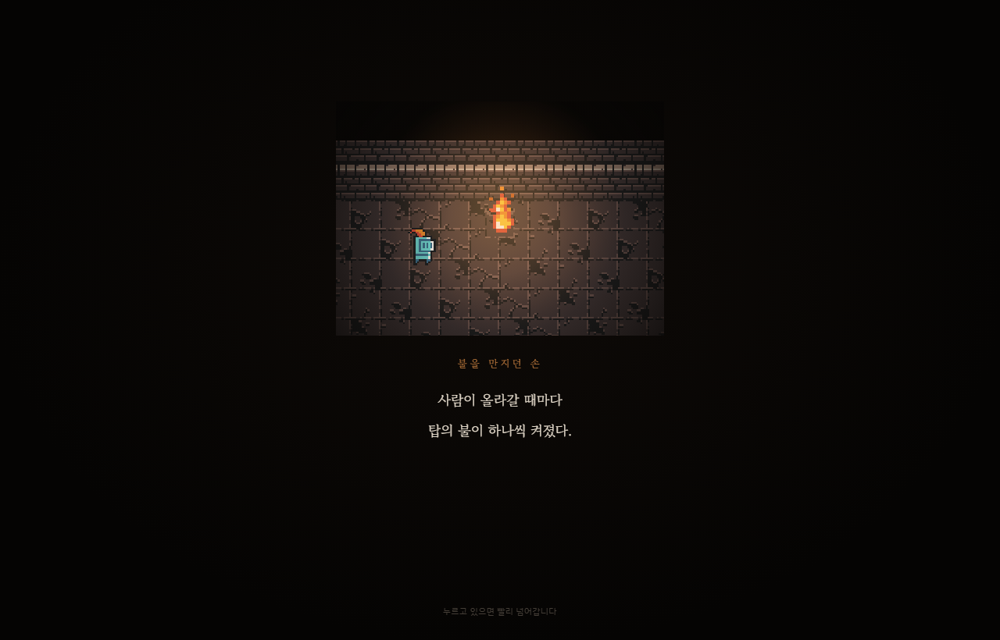
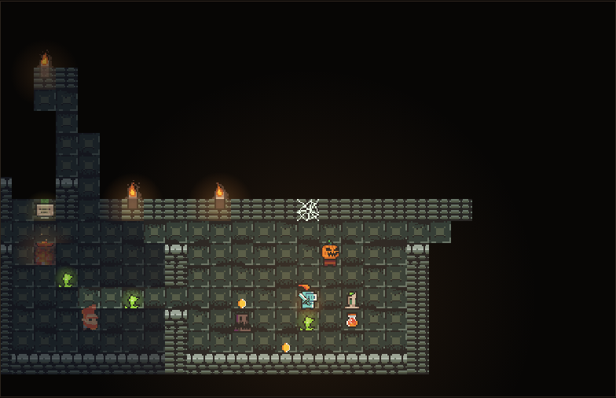

# 잿불 (가제)

불씨를 들고 탑을 오르는 브라우저 턴제 로그라이크. **프로토타입 단계.**

**https://cindertower.com**

기획서: https://claude.ai/code/artifact/d18677bd-0040-4c13-a04f-792a5b798ff6

| | |
|---|---|
|  |  |



화면은 `node tools/make-shots.js` 가 실제 판을 찍어서 만든다 (아래 참고).

---

## 실행

`index.html`을 브라우저로 열면 된다. **로컬 서버 없이 더블클릭해도 돌아간다.**
스프라이트를 데이터 URI로 구워 넣었기 때문이다 (아래 참고).

## 조작

| 키 | 동작 |
|---|---|
| `← ↑ → ↓` / `WASD` | 이동 — 진행 방향에 적이 있으면 공격 |
| `X` + 방향 / `K` | 공격하지 않고 이동. 앞이 적이면 아무 일도 일어나지 않는다(턴 소모 없음) |
| `Z` / `J` | 원거리 — **가장 가까운 것을 스스로 겨눈다.** 대각선도 된다. 「던지던 손」을 되찾아야 열리고, **활을 들면(엘프) 기억 없이도** 쏜다. **지팡이를 들면 불덩이**가 나간다. **기사는 못 쓴다.** 한 번 쏘면 한 턴(불덩이는 두 턴) 쉬어야 한다 |
| `Z` + 방향 | 여럿이 몰렸을 때 그쪽 것을 먼저 겨눈다 |
| `Space` | 한 턴 대기. 상인 앞에서는 다시 말을 건다 |
| `1` | 물약 |
| `F` | 불씨 밝기 — 「끄던 손」을 되찾아야 열린다 |
| `C` | 확성기 — 같은 방에 든 사람끼리 주고받는 창. 링크로 부른다. 서버를 올려야 열린다 |
| `N` | 흔적 — **벽 옆이면** 쪽지를 남기고(한 층에 하나), 남의 쪽지 옆이면 끄덕인다. 서버를 올려야 열린다 |
| `Esc` | 관전 중에는 관전을 그만둔다 |
| `M` | 소리 켜고 끄기 |
| `Esc` | 도감 (조작법·몬스터·아이템·기억·업적) |

장비 비교창에서는 `Z` 교체 / `X` 그대로 두기, 상점에서는 숫자키로 구입.

모바일은 화면 아래 방향 버튼 또는 던전 화면 스와이프.
키보드에만 있던 물약·원거리·불씨·도감은 옆의 행동 버튼으로 꺼내 두었다.
원거리는 **버튼 한 번**이면 된다 — 스스로 겨누므로 방향을 물을 이유가 없다.

---

## 구조

```
index.html      화면 골격 (타이틀 / 게임 / 각종 창)
style.css       전체 스타일
build.js        아티팩트용 단일 HTML 생성
js/
  config.js     상수와 설정 테이블 — 숫자를 만질 일이 있으면 대개 여기
  util.js       난수, 보간, 브레젠험, 조사, 저장/불러오기
  map.js        방 + 복도 층 생성
  fov.js        불씨 시야, 시선 판정
  actors.js     몬스터 표, 스탯, 전투 판정
  items.js      장비 표, 등급, 스탯 재계산, 상점 매대
  heroes.js     고를 수 있는 사람 5종과 시작 스탯·성장치
  levels.js     레벨과 경험치 (판 안에서만 사는 성장)
  memories.js   기억 9종과 누적 확률 보정
  bosses.js     보스 3종과 예고 → 발동 기술
  achievements.js 업적 16종과 달성 조건
  render.js     캔버스 그리기와 연출
  ui.js         HUD, 로그, 커튼 연출, 도감, 각종 창
  game.js       상태, 턴 루프, 입력
  resume.js     판 하나를 접고 펴는 곳 — 이어하기와 관전이 같은 것을 쓴다
  net.js        방 서버와의 연결 — 붙이고, 끊기면 다시 붙인다. 화면은 모른다
  chat.js       확성기 창 — 그리는 것만 한다
  cast.js       방송과 관전 — resume 가 접은 판을 흘려보내고, 받아서 펼친다
  shell.js      앱 껍데기 안에서만 깨어나는 것 (뒤로가기·노치). 웹에서는 잠들어 있다
  sound.js      Web Audio 로 그 자리에서 만드는 소리 (음원 파일 없음)
  sprites.js    자동 생성 — 그림을 데이터 URI로 구운 것 (직접 고치지 말 것)
tools/          브라우저 검증 (playwright), 스프라이트 굽기
server/         방 서버 — Cloudflare Workers + Durable Objects (따로 배포한다)
android/        안드로이드 껍데기 (Capacitor 가 만든 것. 아래 참고)
assets/tileset/ 원본 그림 (0x72 Dungeon Tileset II v1.7)
```

### 나중에 헤집지 않으려고 미리 잡아둔 것

- **턴 루프가 처음부터 속도 기반이다.** 모든 행동자가 매 틱 자기 속도만큼 에너지를 모으고, 100이 차면 한 번 행동하며 100을 쓴다. 속도 18인 박쥐는 속도 10인 플레이어의 1.8배로 움직인다. 이걸 나중에 얹으려면 전투 코드를 통째로 다시 쓰게 된다.
- **그리기가 `Render` 한 곳에 모여 있다.** `drawEntity` 는 스프라이트가 준비되면 그림으로, 아니면 색 사각형 + 글자로 그린다. 그림이 없어도 게임은 그대로 돌아간다 — 에셋을 바꾸거나 빼도 로직을 건드릴 일이 없다.
- **입력이 `{ 방향, 의도 }` 로 감싸여 있다.** 의도(`move` / `pass` / `ranged` / `wait`)에 따라 갈리기만 하고 그 뒤 처리는 공유된다. 키 매핑은 `config.js`의 `KEY_DIR` · `KEY_MOD` 테이블에 있어서, 키 설정 화면을 붙일 때 그 테이블만 건드리면 된다.
- **키 판정은 전부 `event.code`.** `event.key`를 쓰면 한글 입력 상태에서 `Z`가 `'ㅋ'`으로 들어와 조작이 통째로 먹통이 된다.
- **저장은 `saveData()` / `loadData()` 두 함수로만.** 나중에 랭킹을 붙일 때 그 안쪽만 바꾸면 된다.
- **로직은 즉시 실행되고 연출만 따라온다.** 엔티티는 실제 좌표(`x`,`y`)와 그려지는 좌표(`rx`,`ry`)를 따로 갖고, 후자가 전자를 쫓아간다. 그래서 입력이 애니메이션에 막히지 않는다.

---

## 에셋

세 곳에서 온다. **출처가 다르므로 폴더를 섞지 않는다** — `tools/pack-sprites.js` 의 `findFrame` 이
네 폴더를 차례로 뒤지므로, 새 그림을 넣을 때 CC0 원본 자리에 끼워 넣을 이유가 없다.

| 폴더 | 무엇 | 출처 |
|---|---|---|
| `assets/tileset/frames/` | 캐릭터·바닥·벽·무기 | [0x72 Dungeon Tileset II v1.7](https://0x72.itch.io/dungeontileset-ii) · CC0 |
| `assets/tileset-extended/frames/` | 횃불·불꽃·병·열쇠 | [nijikokun 확장팩 v1.1](https://nijikokun.itch.io/dungeontileset-ii-extended) · CC0 |
| `assets/icons/` | 갑옷·로브·장화·목걸이·반지·재의 지팡이·재의 활 | `tools/make-icons.js` 로 우리가 그림 |
| `assets/custom/frames/` | 용 | 우리가 따로 만든 것 |
| `assets/tileset-sewers/` | 11층부터의 하수도 배경 | [0x72 Sewers v0.3](https://0x72.itch.io/16x16-dungeontileset-ii-sewers) · CC0 (**유료 $2**) |

원본은 건드리지 않고, 쓰는 것만 골라 `js/sprites.js` 로 굽는다.

```bash
node tools/make-icons.js       # → assets/icons/ (팩에 없는 갑옷·장신구 17장)
node tools/slice-atlas.js      # → assets/tileset-sewers/frames/ (아틀라스에서 쓸 칸만)
node tools/pack-sprites.js     # → js/sprites.js (143KB, 337장)
```

**하수도 팩만 한 단계가 더 붙는다.** 이쪽은 바닥·벽이 낱장이 아니라 아틀라스 한 장에
붙어 있어서, `pack-sprites.js` 의 `findFrame` 이 찾을 수 있는 모양으로 먼저 잘라야 한다.
그 일을 `tools/slice-atlas.js` 가 한다 — 원본 아틀라스는 그대로 두고 쓸 칸만 뽑으므로,
쓰는 타일을 바꾸려면 그 파일의 `CUTS` 만 고치면 된다.

자르는 데만 크로미움을 쓴다(PNG 를 읽어야 하는데 이 저장소는 의존성을 두지 않으므로
`tools/` 가 이미 쓰고 있는 playwright 를 빌린다). **굽는 것은 여전히 순수 node 라
평소 작업에 브라우저가 필요하지 않다.**

**왜 데이터 URI로 굽는가** — 아티팩트는 HTML 한 장이라 외부 이미지를 못 불러오고,
로컬에서도 `index.html` 더블클릭으로 열 수 있게 유지하고 싶기 때문이다
(브라우저가 `file://` 에서 이미지 로딩을 막는다). 그림이 JS 안에 있으면 둘 다 해결된다.

**갑옷·장신구는 어느 팩에도 없다.** 무기만 그림이 붙으면 장비창이 반쪽이 되므로
`tools/make-icons.js` 가 같은 16px 격자에 팩에서 뽑아낸 색만 써서 직접 그린다.
같은 부류(갑옷 넷, 로브 셋)는 실루엣을 공유하고 색만 바꾼다 —
넷이 서로 다른 모양이면 한 줄에 늘어놨을 때 무엇이 갑옷인지 읽히지 않는다.

**용도 팩에 없다.** 0x72 팩에 용이 아예 없고 도마뱀 계열은 사람 모양이라 쓸 수 없어서
따로 만들었다 (`assets/custom/`, 대기 4장 + 이동 4장).

**다음 층으로 나가는 자리는 층에 따라 갈린다.** 하수도 팩 바닥에 있는 쇠 사다리가
제일 「위로 난 것」처럼 보이는데, **은빛이라 돌 층의 갈색 바닥 위에서는 혼자 튄다.**
그래서 10층까지는 팩 원래 것(`floor_ladder`)을 그대로 두고 11층부터만 바꾼다 —
바닥이 초록 쇠로 바뀌는 층이라 거기서는 맞는다.

그림 하나가 좋아 보인다고 전 층에 깔면 안 된다는 이야기이기도 하다.
**어디에 놓이는지가 그림의 절반이다.** (더 나은 것이 생기면 `pack-sprites.js` 의
`stairs` · `sewer.stairs` 두 줄만 갈아 끼우면 된다)

쓰는 그림을 바꾸려면 `tools/pack-sprites.js` 의 `CHARACTERS` · `MANIFEST` 만 고치고 다시 구우면 된다.
**`js/actors.js` 의 몬스터 `id` 는 그림과 이어지는 열쇠**이므로 바꾸지 말 것 (이름은 바꿔도 된다).

| 게임 | 그림 | 게임 | 그림 |
|---|---|---|---|
| 플레이어 | knight_m | 타다 만 것 | tiny_zombie |
| 고블린 | goblin | 불티 | imp |
| 가면 쓴 것 | masked_orc | 재의 주술사 | orc_shaman |
| 오크 | orc_warrior | 해골 전사 | skelet |
| 창백한 망령 | wogol | 산성 오움 | swampy |
| 부푼 것 | big_zombie | 어둠의 마법사 | necromancer |
| 오우거 | ogre | 상인 | dwarf_m |
| 용 | dragon (직접 제작) | | |
| 느린 시체 | zombie | 진창 | muddy |
| 호박 머리 | pumpkin_dude | 오움 | slug |
| 작은 오움 | tiny_slug | 식은 것 | ice_zombie |
| 검은 의원 | doc | 큰 악귀 | big_demon |
| 문지기 (5층) | chort | 이름을 가진 것 (10층) | angel |
| 등불지기 (15층) | knight_m + 불빛 | | |

마지막 보스가 플레이어와 같은 그림에 불빛만 입힌 것은 의도한 것이다 —
**당신의 얼굴을 하고 있다.**

## 기억 — 메타 진행

고대의 등급 장비를 주우면 확률적으로 기억 하나를 되찾는다. 되찾은 것은 죽어도 남는다.
한 판에 하나까지. 목록과 효과는 `js/memories.js` 한 곳에 있다.

확률에만 맡기면 운 나쁜 판은 성장 없이 끝나고, 그게 반복되면 이탈로 이어진다.
그래서 **기억 없이 끝난 판이 쌓이면 `pity` 가 오르고 두 군데에 작용한다** —
고대의 장비가 더 자주 나오고(굴릴 기회 자체를 늘린다), 굴렸을 때 확률도 오른다.
플레이어에게 알리지 않는다.

| pity | 기억 확률 | 고대의 가중치 (기본 등급은 6) |
|---|---|---|
| 0 | 62% | 2 |
| 1 | 82% | 4 |
| 2+ | 98% | 6~12 |

여기에 더해, **아직 기억이 하나도 없으면 pity 에 3을 얹는다.** 병목은 확률이 아니라
"고대의 장비를 만나는 것" 자체였다 — 초반 층에는 후보가 거의 없어서 굴릴 기회가 아예 없다.
처음 두어 판이 아무 성과 없이 끝나면 사람은 그냥 그만둔다.

**그런데도 "기억이 안 모인다"가 계속 나왔다.** 재어 보니 확률은 낮지 않았다 —
고대의를 밟기만 하면 62~98% 다. 문제는 밟을 것이 없다는 쪽이었다.
고대의 목록의 등장 층이 4·6·9·10 층이라 **4층 아래에는 후보가 통째로 0개**였고,
초반에 죽는 판은 확률이 나쁜 게 아니라 **굴릴 일 자체가 한 번도 안 왔다.**
확률을 아무리 올려도 안 풀리는 종류의 병목이다.

그래서 두 가지를 고쳤다. 앞쪽(2·3층)에 「고대의」 둘을 놓되 **세기가 아니라 기회를
놓는 자리**라 값은 얌전하게 잡았고(재의 부적·재의 조끼), 기본 가중치를 2에서 3으로 올렸다.
8층에서 죽는 판이 고대의를 한 번이라도 만날 확률이 **0.61 → 0.69**, 4층까지만 가도
**0 → 0.32** 가 되었다.

**어떤 숫자가 낮은지 재기 전에 올리지 말 것.** 여기서 올려야 했던 것은 확률이 아니라
후보의 등장 층이었다.

## 클래스가 싸움의 형태를 정한다

숫자만 다른 다섯이 아니라 **조작 자체가 다른 다섯**이어야 고르는 의미가 있다.

- **기사는 원거리가 통째로 없다.** `Z` 가 잠긴 게 아니라 없는 조작이다 — 모바일 버튼도
  안 보인다. 「던지던 손」을 되찾아도 조작이 열리는 대신 **완력(공격 +2)으로 붙는다**.
  기사에게만 꽝인 기억을 남겨 두면 수집이 벌이 되기 때문이다. 3층의 원거리 보장 지급도
  기사는 건너뛴다 — 그건 보상이 아니라 조작을 여는 장치라서, 열 조작이 없는 사람에겐
  줄 것도 없다. 원거리를 내준 값은 기본기와 성장으로 돌려받는다.
- **엘프는 활을 들고 시작한다.** 활이 손에 있으면 「던지던 손」 없이도 `Z` 가 나간다 —
  활이 곧 그 조작이다. 1층부터 원거리로 싸우므로 고르는 순간 다른 게임이 된다.
  활을 검으로 바꾸면 (기억이 없는 한) 다시 못 쏘게 되는데, 이건 스탯 표에 안 보이는
  값이라 비교창이 말로 경고한다.
- **활은 엘프에게만 나온다** (`GEAR` 의 `only` 필드). 다른 사람에게는 "주워도 못 쓰는
  함정 아이템"이 되므로 애초에 굴리지 않는다 — 드랍도 상점도 마찬가지다.
  도감에는 모두에게 보이되 「엘프 전용」 딱지가 붙는다.
- 무엇이 날아가는가는 여전히 손에 든 것이 정한다 — 활이면 화살(0.85배), 지팡이면
  불덩이(0.8배 + 번짐), 그 밖에는 던지기(0.7배).

**장착한 무기는 캐릭터 손에 그려진다.** `Render.heldWeapon` 이 비교창 아이콘을 그대로
그립(손잡이)을 축으로 기울여 들고, 공격(bump) 중에는 휘두른다. 지팡이류는 원본이 몸의
두 배라 몸 높이 남짓으로 잘라 맞춘다 — 안 그러면 든 게 아니라 떠 있는 것처럼 보인다.

## 무기 갈래가 닿는 자리를 정한다

처음에는 단검·검·도끼·창이 **전부 같은 무기**였다. `weaponKind` 가 근접을 통째로
`blade` 하나로 묶었고, 넷의 차이는 공격력과 속도 숫자 둘뿐이었다.
이름이 넷인데 화면에서 하는 일이 똑같으면 그건 무기가 넷인 게 아니라 하나다.

지금은 갈래가 닿는 자리를 정한다 (`items.js` 의 `WEAPON_REACH`):

| 갈래 | 닿는 칸 | 값을 어디서 치르나 |
|---|---|---|
| **단검** | 앞 한 칸 | 제일 약하고 제일 빠르다. 대신 **독을 바른다** |
| **검** | 앞 + 그 양옆 대각선 | 중간. 대신 한 번에 셋을 쓸어 여럿에게 닿는다 |
| **창** | 앞 한 칸, 그리고 두 칸째 | 중간. 대신 **맞지 않고 때린다** |
| **도끼·망치** | 앞 한 칸 | 제일 아프고 제일 굼뜨다 |

**정면을 `(1,0)` 으로 한 번만 적는다.** `meleeTiles()` 가 네 방향으로 돌린다 —
네 방향을 네 번 적으면 반드시 한 군데가 어긋난다.

### 「쓸리는 자리」와 「시작할 수 있는 자리」는 다르다

검의 대각선에서는 **공격을 시작할 수 없다**(`init` 이 안 붙는다). 붙이면 옆에 적이
있을 때마다 앞으로 못 걷는다 — 빈 칸을 향해 걸었는데 사람이 칼을 휘두르면
그건 범위가 아니라 고장으로 읽힌다. 검의 대각선은 **정면을 칠 때 함께 쓸리는** 자리고,
창의 두 칸째는 **거기부터 찌를 수 있는** 자리다. 이 차이가 두 무기의 전부다.

쓸리는 자리는 피해가 얕게 든다(검 60%, 창의 두 칸째 85%). 정면과 같은 세기로
때리면 "저기서도 시작할 수 있다"로 읽혀서 실제 조작과 어긋난다.

### 범위는 늘 켜 두지 않는다

무기가 어디까지 닿는지는 숫자로 적어 두면 아무도 안 읽는다. 그렇다고 네 방향을
항상 밝히면 빈 복도를 걷는 내내 열두 칸이 깜빡이고, 그러면 그건 정보가 아니라 무늬다.

**닿는 자리에 실제로 뭔가 있을 때만** 켠다 (`Render.meleeHint`). 그 순간에만 뜻이
있는 표시다. 쓸리기만 하는 자리는 옅게 칠해서 "저기선 시작 못 한다"가 눈으로 갈린다.
비교창의 「무기」 자리에도 갈래와 하는 일을 적는다 — `검 · 앞과 그 양옆, 세 칸을 쓴다`.

### 추천 무기는 잠그지 않는다

| | 갈래 | 시작 무기 |
|---|---|---|
| 기사 | 검 | 짧은 검 |
| 엘프 | 활 | 사냥 활 |
| 마법사 | 지팡이 | 낡은 지팡이 |
| 리자드 | 단검 | 낡은 단검 |
| 드워프 | 도끼 | 손도끼 |

손에 쥐고 시작하는 한 자루와 드랍 무게(`likes`, 3배)로 충분하다. 활만 `only` 로
묶여 있는데 그건 활이 **조작 자체를 바꾸기** 때문이고, 나머지는 주우면 누구나 쓴다 —
잠그면 노선을 갈아타는 판이 사라진다.

**시작 무기는 시작을 정하는 물건이지 앞서게 하는 물건이 아니다.**
처음에는 기본기 위에 그냥 얹었다. 그랬더니 마법사가 1층부터 주문 15 로 출발했고
**파이어볼 한 방에 4층까지 전부 죽었다** — 몬스터 체력이 5~11 인데 12 가 나간다.
그래서 **무기가 얹는 만큼 기본기에서 뺀다.** 1층 합계가 시작 무기가 생기기 전과
같아지도록 (마법사 8 · 리자드 5 · 드워프 8). 엘프는 원래부터 활을 들고 있었으므로
그대로다.

기사만 절반을 남긴다(8 → 6). 통째로 뺐더니 40판에서 클리어 10% 까지 무너졌다 —
원거리가 통째로 없는 값을 기본기로 돌려받는 사람이라, 그 값까지 무기에 실어
버리면 남는 것이 없다.

마법사의 낡은 지팡이는 주문 4 라 「주문은 기본 공격(5)보다 높아야 한다」는 규칙에
어긋나므로, 활처럼 `only` 로 마법사에게만 묶었다 — 남에게는 애초에 안 나온다.

> 창은 갈래 하나에 무기가 하나뿐이다(긴 창). 다섯 중 누구의 추천 무기도 아니라서
> 주웠을 때만 써 보게 되는 물건이 하나쯤 있어야 무기를 줍는 일에 뜻이 생긴다.
> 다만 그 값으로 **드랍의 1% 밖에 안 된다** — 2칸 사거리를 평생 못 만나는 사람이
> 대부분이라는 뜻이라, 흔한 등급을 하나 더 넣을지는 아직 안 정했다.

## 「던지던 손」만 확률에 맡기지 않는다

다른 기억은 세지는 것이지만 「던지던 손」은 조작 하나를 여는 것이다.
운이 나쁘면 원거리를 한 번도 못 써보고 판이 끝나는데, 그러면 게임의 절반을 못 본 채
"이거 그냥 부딪히는 게임이네"가 된다. 그래서 **3층에 닿으면 무조건 준다**
(`CFG.THROW_FLOOR`). 한 판에 하나라는 제한과 pity 는 건드리지 않는다 —
이건 보상이 아니라 조작이므로 기억의 경제와 따로 논다.
**기사만 예외다** — 열어줄 조작이 없는 사람이라 보장도 없다 (위의 클래스 절 참고).

## 원거리는 방향이 아니라 대상으로 쏜다

처음에는 방향키를 눌러 그 줄로 던졌다. 그랬더니 **대각선에 선 몬스터를 두고
줄을 맞추려 한 칸 옮기는 동안 두 대를 맞는** 상황이 계속 나왔다.
그 한 칸이 재미있는 판단이었다면 몰라도, 실제로는 그냥 손해만 보는 절차였다.

지금은 `Z` 한 번이면 **보이고, 벽에 막히지 않고, 사거리 안에 있는 것 중 가장 가까운 것**을
스스로 겨눈다. 방향키를 같이 누르면 그쪽 것을 먼저 보므로, 여럿이 몰렸을 때 쪽을 정할 수는 있다.
겨눌 것이 없으면 **턴을 쓰지 않는다** — 아무 일도 안 일어나는 데 한 턴을 내주면
그건 조작이 아니라 벌이다.

모바일에서도 두 단계(겨누기 → 방향)가 한 번으로 줄었다.

**이 편의는 공짜가 아니었다.** 처음 오르는 사람의 클리어율이 54%에서 86%로 뛰었다.
원거리의 값어치가 피해량이 아니라 **"맞지 않는 것"** 이었기 때문이다 —
줄을 맞출 필요가 없어지자 매 턴 쏘는 게 언제나 최선이 되어, 몬스터가 닿기 전에 정리된다.
그래서 위력을 30% 깎아 봤지만 **85%로 1%p 밖에 안 움직였다.** 손대야 할 곳이 아니었던 것이다.

그래서 위력이 아니라 **빈도를 조였다.** 한 번 쏘면 한 턴을 쉬어야 다시 쏜다
(`state.rangedCd`). 불덩이는 광역이라 두 턴을 쉰다 — 화살·던지기와 같은 리듬을 주면
언제나 불덩이가 이겨서, 모든 캐릭터가 지팡이로 수렴해 버린다.
쉬는 턴에 쏘려 하면 아무 일도 일어나지 않고 **턴도 쓰지 않는다** — 벌이 아니라 리듬이다.
이것만으로 마법사 클리어율이 90%에서 77%로 내려왔다. 위력 30%가 못 하던 일을
빈도 한 턴이 해냈다 — **몇 턴에 한 번 쓰는가가 실제 레버라는 것이 실측으로도 맞았다.**

## 소리

음원 파일을 쓰지 않는다. `js/sound.js` 가 Web Audio 로 그 자리에서 합성한다.
파일이 0개라 아티팩트 단일 HTML 구조가 그대로 유지되고, 용량도 13KB 밖에 안 붙었다.

- 사건별 소리 23종. 같은 소리도 매번 음정을 조금씩 흔들어 기계음처럼 안 들리게 한다.
- **보스 예고음은 협화음을 피했다**(증4도). 화면을 안 보고 있어도 "피해야 한다"가 들려야 한다.
- 배경은 낮은 드론 하나와 이따금 튀는 불씨 소리. **층이 오를수록 드론이 내려간다** — 1층 58Hz에서 15층 40Hz까지. 조여드는 느낌이 공짜로 생긴다.
- 그 위에 **선율이 드문드문 얹힌다.** 곡을 트는 것이 아니라 음을 놓는다 —
  드론과 같은 뿌리의 단조 5음계에서 3~9초에 하나씩, 이웃한 음으로만 옮긴다
  (멀리 뛰면 선율이 아니라 무작위로 들린다). 층이 깊을수록 뜸해진다.
  음 하나하나는 길게 피어났다 길게 사그라들어(attack 0.5s / release 2s)
  또렷한 멜로디가 아니라 「탑 어딘가에서 들려오는 것」이 된다.
  층이 내려앉으면 드론과 함께 선율도 내려앉는다 — 조는 언제나 저절로 맞는다.
- 발소리는 음이 아니라 **훅 꺼지는 잡음**이다. 「챱」의 정체는 음정이 아니라
  밴드패스를 위에서 아래로 빠르게 쓸어내리는 것이고, 밑에 낮은 툭을 얇게 깔면
  발이 땅에 닿는 무게가 붙는다. 하수도(11층~)는 더 낮고 더 오래 — 더 질척하다.
- `M` 키로 음소거, 상태는 저장된다.

**브라우저는 사용자가 누르기 전에는 소리를 못 낸다.** AudioContext 를 첫 입력에서 깨우지 않으면
"왜 소리가 안 나지"로 한참 헤맨다. 그리고 턴제라 한 턴에 소리가 몰리므로
동시 재생 수를 제한하고 같은 소리의 최소 간격을 둔다 — 안 그러면 찢어진다.

## 레벨 — 판 안의 성장

기억은 판을 넘어 남는 성장이고, 레벨은 이 판에서만 사는 성장이다. 둘 다 있어야 하는 이유가 다르다.
**기억만 있으면 이번 판에 잘해도 이번 판이 편해지지 않아서 몬스터를 잡을 이유가 사라진다** —
피해서 계단만 찾는 게 언제나 이득이 된다. 반대로 레벨만 있으면 죽는 순간 전부 사라져서 다시 시작할 이유가 없다.

- 경험치는 몬스터(체력/4 + 공격 + 주문), 층 통과(`8 + 층×3`), 보스(`25 + 층×4`)에서 온다.
  층 통과분이 있어야 싸움을 피해 다니는 사람도 위층에서 벽에 막히지 않는다.
- 레벨업은 **최대 체력의 25%를 회복시킨다.** 위기를 뒤집는 순간이 되어야
  "한 마리 더 잡고 갈까"라는 판단이 생긴다.
- 성장치는 사람마다 다르다 (`js/heroes.js` 의 `grow`). 소수로 적고 누적해서 내림하므로
  `0.5` 는 두 레벨에 1이 붙는다는 뜻이다.

**공격과 주문은 반드시 같은 값(`pow`)으로 함께 오른다.** 전투 판정의 유일한 규칙이
"주문 > 공격이면 마법"이라, 레벨이 공격만 올리면 8레벨 기사에게 주술 지팡이(주문 +12)가
공격을 못 넘어서 **주워도 아무 일이 안 일어나는 함정 아이템**이 된다.
둘을 같이 올리면 순서가 절대 뒤집히지 않아 레벨이 몇이든 지팡이는 지팡이 노릇을 한다.
`tools/test-levels.js` 가 사람 5종 × 레벨 5구간 × 지팡이 전부를 돌며 이걸 확인한다.

## 이어하기

한 판이 스무 분 남짓 걸리는데 탭을 닫으면 통째로 날아간다. 폰에서는 전화 한 통으로 끝난다.
"하다가 끊겨서 다시 안 하게 됐다"가 가장 흔한 이탈 이유라, 재미를 더하는 기능이 아니라 잃는 것을 막는 장치다.

- **기억·업적과 다른 칸(`jaetbul.run.v1`)에 저장한다.** 판은 끝나면 지워야 하고 기억은 판을 넘어 남아야 하므로 수명이 다르다.
- 지도는 줄마다 문자열 하나로 접는다(타일 0~5, 탐험 여부 0/1). 그래서 15층 한복판의 판 전체가 **3.8KB**다.
- 매 턴 · 층 진입 · `visibilitychange` · `pagehide` 에서 저장한다. 탭이 닫히는 순간을 브라우저가 보장해 주지 않기 때문이다.
- 저장 여부는 `state.running` 이 아니라 별도 표시(`state.resumable`)로 판단한다. 층 진입 연출 중에도 저장이 걸려야 그 몇 초 사이에 한 층을 잃지 않는다.
- 보스는 좌표와 체력만 저장하고 층 정의에서 다시 세운다. 기술 테이블까지 저장할 이유가 없다.

## 확성기 — 친구와 같은 방에서

`C` 를 누르면 구석에 창이 하나 뜬다. 같은 방에 들어간 사람들끼리 한 줄씩 주고받는다.
**모달이 아니라 구석에 붙는 판이다** — 채팅을 열어 둔 채로 계속 오를 수 있어야 확성기지,
말하려고 게임을 멈춰야 하면 그건 그냥 채팅창이다.

**서버는 따로 올린다.** 게임은 정적 호스팅에 그대로 두고, 방 서버만 Cloudflare Workers +
Durable Objects 에 올린다 (`server/` 참고). 방 하나가 Durable Object 인스턴스 하나이고,
아무도 말이 없는 동안은 하이버네이션으로 내려가 있다가 다시 붙는 시간 없이 깨어난다.
둘이 가끔 들어와 떠드는 방에는 상시 켜 둔 서버보다 이 편이 맞다.

**`NET.HOST` 가 비면 확성기는 아예 없는 기능처럼 군다** — 버튼도 안 보이고 `C` 도 먹지 않는다.
`index.html` 을 더블클릭해 연 경우(`file://`)에는 네트워크가 어차피 막혀 있으므로,
**꺼진 채로 게임이 멀쩡한 것이 정상 동작이지 예외가 아니다.**

그래서 빌드를 둘로 가르지 않았다. 대신 **`build.js` 가 아티팩트를 구울 때만 `HOST` 를 비운다.**
아티팩트는 HTML 한 장이라 바깥으로 연결을 열지 못하는데, 주소가 박힌 채로 구우면
붙지도 못하는 버튼이 보이고 "다시 붙는 중"만 끝없이 돈다. 없는 기능은 없어 보이는 게 맞다.
소스(`js/config.js`)는 건드리지 않고 굽는 동안만 비운다.

### 방 이름을 부르지 않고 링크로 건넨다

처음에는 `ember-3721` 처럼 짧게 만들어 **말로 불러 주는** 방식이었다. 그러면 두 가지가 동시에 무너진다.

**짧으니까 뚫린다.** 단어 8개 × 숫자 9000 = 7만 2천 가지뿐이라, 초당 열 번씩 찔러 보는
스크립트면 두 시간 안에 전부 훑는다. 방 이름이 사실상 열쇠 노릇을 하는데 열쇠치고 너무 짧다.

**그렇다고 사람에게 짓게 하면 더 나쁘다.** 사람이 치는 것은 `test`, `1234`, `asdf` 다.
다른 날 다른 친구와 각각 방을 파면 **같은 이름으로 같은 방에 들어간다** — 지난 대화까지 그대로 보인다.
사람은 무작위를 못 만든다.

그래서 순서를 뒤집었다. **외우지 않아도 되게 만들면 길어도 된다.**

- `새 방` 은 `flint-sn543877` 처럼 단어 하나에 무작위 8글자를 붙인다 (**8.8조 가지**)
- 무작위는 `Math.random` 이 아니라 `crypto.getRandomValues` 로 뽑는다.
  **던전을 만드는 난수와 열쇠를 만드는 난수는 다른 물건이다**
- 헷갈리는 `l·1·o·0` 을 뺀 32글자를 쓴다. 32 가 256 을 나누어떨어지므로
  바이트를 그냥 나머지 연산해도 한쪽으로 치우치지 않는다
- 들어가면 주소창이 곧 초대장이 된다. **링크 복사** 로 건네면 친구는 누르기만 하면 된다

**`?r=` 이 아니라 `#r=` 인 것이 중요하다.** 해시는 서버로 전송되지 않는다 —
물음표로 넣으면 방 이름이 정적 호스팅의 접근 로그에 그대로 남고, 바깥으로 나가는
Referer 에도 실린다. 열쇠 노릇을 하는 값을 로그에 남길 이유가 없다.

**플레이스홀더에 그럴듯한 방 이름을 두지 않는다.** 회색으로 `ember-3721` 같은 것이 떠 있으면
사람은 보이는 대로 친다 — 그러면 아무 생각 없이 누른 사람들이 전부 같은 방에서 만난다.
방 이름을 8.8조 가지로 늘려 놓고 기본값을 하나 남겨 두면 늘린 의미가 없다.
**비운 채로 들어가면 새 방을 판다** — 실수의 결과가 "모두가 아는 방"이 아니라
"아무도 모르는 방"이어야 한다.

링크로 들어와도 **별명이 없으면 자동으로 넣지 않는다.** 이름도 모르는 채로 남의 방에
떨어뜨려 놓으면 "누구세요"가 된다. 그때는 방만 채워 두고 별명 칸에 커서를 둔다.

### 기록은 남되, 오래는 아니다

방은 최근 50줄을 들고 있다가 들어온 사람에게 넘긴다. 친구가 5분 뒤에 들어와도
"야 지금 몇 층"이 사라져 있으면 안 되고, 폰에서 화면 껐다 켜서 소켓이 죽었을 때
백지가 되면 확성기로 쓸 수가 없다.

다만 **12시간이 지난 줄은 넘기지 않는다.** 방 이름이 곧 열쇠인데 기록이 영원히 남으면
어쩌다 이름이 새는 순간 지난 대화가 통째로 딸려 나간다. 따로 청소하는 일을 만들지 않고,
말할 때마다 늙은 줄이 함께 떨어져 나가게 했다.

**대화 지우기** 는 방 안에 있는 사람이면 누구나 누를 수 있다 — 둘이 쓰는 방에 권한 체계를
세울 이유가 없고, 지우는 쪽은 언제나 안전한 방향이다. 되돌릴 수 없으므로 버튼이
**한 번 되묻고**, 몇 초 지나면 스스로 원래 말로 돌아간다. `confirm()` 창을 띄우지 않은 것은
게임 위로 시스템 대화상자가 덮이는 게 싫어서다.

## 관전 — 리플레이를 만들지 않았다

같은 방 사람이 **방송 시작** 을 누르면, 다른 사람 화면 위에 띠가 뜨고 **보기** 를 누르면
그 판이 실시간으로 보인다.

새로 만든 것이 거의 없다. `resume.js` 가 이미 **판 하나를 통째로 3.8KB 로 접고 있었고**
매 턴 저장하는 훅도 걸려 있었다. `render.js` 는 `state` 를 보고 그린다.
그러니 접은 것을 소켓으로 흘려보내고 받은 쪽이 자기 `state` 에 펼치면 그게 곧 관전이다.
전송 포맷도, 리플레이 형식도, 새 렌더러도 만들지 않았다 —
**`saveRun()` 을 `packRun()` 과 저장으로 가른 것**이 작업의 절반이었다.

입력 로그를 주고받는 흔한 방식을 안 쓴 이유가 있다. 이 게임의 난수는 `Math.random` 이라
같은 입력이 같은 결과를 내지 않는다. 그리고 상태를 통째로 보내면 **한 장을 잃어버려도
다음 장이 전체이므로 스스로 복구된다** — 입력 리플레이의 최악(한 번 어긋나면 그 뒤 전부 쓰레기)이 없다.
늦게 들어온 사람에게 마지막 한 장만 건네면 그 장면부터 바로 보이는 것도 같은 성질이다.

### 남의 판이 내 판을 덮지 않아야 한다

관전은 전역 `state` 를 통째로 갈아치우는 일이라, 기능 자체보다 **이쪽이 훨씬 위험하다.**
`tools/test-cast.js` 의 검사 절반이 여기에 쓰여 있다.

- **받았다고 바로 들어가지 않는다.** 반드시 사람이 «보기» 를 눌러야 시작한다
- **관전 중에는 저장이 걸리지 않는다.** `packRun()` 이 `state.spectating` 을 보고 물러선다.
  그래서 내 판은 `localStorage` 에 그대로 있고, 관전을 끝내면 **그 자리에서 이어진다**
- **관전 중에는 입력이 판을 건드리지 않는다.** 확성기만 열린다
- **기억을 블롭에 실어 보낸다.** 예전 복원 코드는 그 브라우저 주인의 저장값에서 기억을 읽었는데,
  남의 판을 그렇게 복원하면 **관전자의 기억으로 스탯을 세워 체력과 공격력이 딴판**이 된다
- **`chooseHero()` 를 부르지 않는다.** 그건 저장까지 하는 함수라, 남의 판을 보다가
  내가 고른 캐릭터가 바뀌어 버린다. 저장하지 않고 잠깐 덮어쓰는 자리를 따로 두었다

### 그 밖에 걸렸던 것

**죽는 순간이 안 보였다.** `packRun()` 이 `alive` 를 요구해서, 쓰러지면 마지막 장이 안 나간다.
관전에서 제일 보고 싶은 순간이 하필 거기라 `over` 를 따로 보낸다.

**몬스터가 순간이동했다.** 스냅샷마다 새로 만들면 그려지는 좌표(`rx`·`ry`)가 실제 좌표에 붙어
이 게임이 공들인 보간이 관전에서만 죽는다. 몬스터에 변하지 않는 표(`uid`)를 붙여
이전 장의 자리를 이어받게 했다.

**띠를 게임 화면 안에 두었더니** 아직 판을 시작하지 않은 사람(타이틀 화면)에게는 통째로 안 보였다.
관전만 하려는 사람이 정확히 그 처지라, 화면 바깥으로 뺐다.

**보내는 빈도가 대역폭보다 문제다.** 방향키를 누르고 있으면 초당 여러 장이 나간다.
250ms 로 조이되 **마지막 한 장은 반드시 보낸다** — 조이느라 그걸 흘리면 관전 화면이
한 턴 뒤처진 채로 멈춘다.

**소리는 관전자에게 내지 않는다.** 블롭에는 "무슨 일이 있었는지"가 없고 결과 상태만 있다.
배경 드론만 층에 맞춰 옮긴다.

### Origin 검사가 막는 것과 못 막는 것

**`Origin` 은 그냥 헤더다.** 브라우저는 위조하지 못하지만 `curl` 이나 스크립트는 원하는 값을 써넣는다.
그러니 이 검사가 실제로 막는 것은 **남의 웹사이트가 방문자의 브라우저로 이 방에 붙는 것**이고,
작정하고 스크립트를 짜는 사람은 못 막는다. 워커 주소는 페이지 소스에 그대로 들어 있다.

방이 안전한 근거는 Origin 검사가 아니라 **방 이름이 8.8조 가지라는 것**이다.
Origin 검사는 그 위에 덧대는 것이지 그것 자체가 자물쇠는 아니다.

### 붙이면서 실제로 터진 것 세 가지

**입력칸에 포커스가 있으면 게임 키가 새 들어온다.** 채팅에 "wasd" 라고 치는 동안
캐릭터가 네 칸 움직이고, "1" 을 치면 물약을 마신다. `onKeyDown` 맨 앞에서 물러서게 해야 한다.
조용히 터지는 데다 한참 뒤에나 알아차리게 되는 종류라, `tools/test-chat.js` 의 검사 절반이 이걸 본다.

**한글 조합 중의 `Enter` 는 보내라는 뜻이 아니다.** "안녕" 의 `ㅕ` 를 고르는 Enter 가
문장을 반토막 내서 날려 버린다. `isComposing` 을 봐야 하는데, 이건 이 저장소가 이미
`event.code` 를 고집하는 이유(한글 입력 상태에서 `Z` 가 `ㅋ` 으로 들어오는 것)와 같은 뿌리다.
**채팅은 이 게임에서 한글을 쳐야 하는 유일한 곳이라** 그 문제를 정면으로 맞는다.

**WebSocket 은 CORS 프리플라이트를 타지 않는다.** 브라우저가 막아 주지 않으므로 서버가
`Origin` 을 직접 보지 않으면 아무 사이트나 방에 붙는다. `server/wrangler.jsonc` 의
`ALLOWED_ORIGINS` 에 게임 주소를 적어야 잠긴다.

### PartySocket 을 안 쓴 이유

클라이언트 재접속은 `js/net.js` 에서 직접 한다. `partysocket` 패키지가 그 일을 해 주지만
ESM/CJS 로만 나오고 UMD 빌드가 없다. 이 게임은 `<script>` 로 전역 스크립트를 순서대로 읽고
`build.js` 가 그걸 통째로 이어붙이는 구조라, `import` 를 섞는 순간 아티팩트 단일 HTML 이 깨진다.
지수 백오프에 흔들림을 섞고 심장박동을 두는 것까지 해서 마흔 줄쯤이라 직접 쓰는 편이 쌌다.

## 오늘의 탑 — 좌표에 뜻이 생기려면 지형이 같아야 한다

흔적을 처음 붙였을 때 **86%가 읽을 수 없는 자리에 있었다.** 지도가 판마다 새로
만들어지는데 흔적은 좌표로 저장되니, 남이 「(7,12)」에 남긴 것이 내 지도에서는
돌 속이거나 허공이었다. 200판을 만들어 재 보니:

```
쪽지 자리가 남의 지도에서 설 수 있는 칸일 확률 : 36.0%
  그 위가 벽이기까지 할 확률                  : 14.0%
무덤 자리를 밟을 수 있을 확률                 : 36.0%
```

화면에는 아무 일도 일어나지 않는다. 벽 속에 박힌 표지판은 그냥 안 그려지므로
**「아직 아무도 안 왔나 보다」와 구별되지 않는다.** 그래서 조용히 고장 나 있었다.

고친 방법은 **날짜로 지형을 고정하는 것**이다. 같은 날 오르는 사람은 모두 같은
열다섯 층을 본다. 좌표가 곧 장소가 되고, 위 확률은 전부 100%가 된다.

**바꿔치기하는 것은 지형뿐이다.** 몬스터도 전리품도 그대로 판마다 다르다.
「탑」은 지형이지 내용물이 아니고, 하루에 두 판째부터 전리품까지 똑같으면
같은 판을 두 번 하는 것이 된다. 흔적이 필요로 하는 것도 지형뿐이다.

구현은 `js/util.js` 한 군데다. 이 게임의 난수가 `randInt`/`choice`/`chance`
셋으로 모여 있어서, 지형을 만드는 동안만 그 뿌리를 씨앗 달린 것으로 바꿔치기하면
(`withSeed`) **`map.js` 는 한 줄도 고치지 않는다.** 예외가 나도 `finally` 로
되돌린다 — 여기서 새면 그 뒤로 게임 전체가 같은 수를 반복하고, 그건 아주 찾기
어려운 버그가 된다.

- 날짜는 **UTC** 다. 시간대마다 다른 탑을 주면 흔적이 국경에서 끊긴다
- 판이 오르는 탑은 **시작한 날**의 것이다(`state.day`, 이어하기에도 실린다).
  매 층 새로 물으면 자정을 넘기는 순간 오르던 탑이 발밑에서 바뀐다
- 밸런싱 시뮬은 판마다 다른 날짜를 준다. 안 그러면 재는 것이 「이 게임의 난이도」가
  아니라 「오늘 탑의 난이도」가 된다

### 아침마다 비는 것은 받아들인다

날짜로 나뉘므로 **매일 아침 모든 층이 텅 빈다.** 한동안 탑이 스스로 길잡이 쪽지를
한둘씩 남기게 해 뒀었다(`js/guide.js`) — 처음 올라온 사람이 보는 "아직 아무도
없구나"와 "이 기능은 없는 건가"가 화면에서 구별되지 않아서였다.

**걷어냈다.** 남이 남긴 말과 탑이 지어낸 말이 같은 얼굴로 걸려 있으면, 진짜로 사람이
지나갔다는 것이 값을 잃는다. 빈 벽은 빈 채로 두고 사람이 채우게 한다.

## 흔적 — 접속해 있지 않은 사람과 이어진다

확성기와 관전은 둘 다 **동시에 두 명**이 있어야 쓸모가 생긴다. 혼자 하는 게임에서
그런 순간은 거의 안 온다. 흔적은 비동기다 — 아무도 접속해 있지 않아도 **남이 지나간
자리가 내 판에 남아 있다.** 서버가 있어서 얻는 것 중 값이 제일 큰 자리가 여기다.

세계관과도 정확히 맞물린다. 이 탑은 원래 「이름을 적으면 그 사람이 올라갔고,
아무도 내려오지 않았다」는 곳이다. 남의 시체가 층에 쌓여 있는 것이 설정 그 자체다.

- **죽은 자리** — 누가 무엇에게 당했는지 해골이 남는다. 밟으면 그 사람이 들고 있던
  것을 줍는다(`8 + 층×3` 골드). 한 번 주우면 다시는 안 나온다
- **벽의 쪽지** — 벽 옆에서 `N`. 한 층에 하나만 쓴다. 남의 쪽지 옆에서 `N` 은 끄덕임이고,
  끄덕인 수만큼 그 표지가 밝게 빛난다. 타이틀에서 **내 말을 몇 명이 읽었는지** 본다

### 「위쪽 벽만」은 설명할 수 없는 규칙이었다

처음에는 위가 벽일 때만 쓸 수 있었다. 표지가 벽에 붙는 그림이라 횃불과 같은 조건을
쓴 것이었는데, 재 보니 **설 수 있는 칸의 20% 에서만** 쓸 수 있었다. 나머지 80% 에서는
`N` 을 눌러도 아무 일도 안 일어나므로 「조건이 안 맞는다」가 아니라 **「이 기능은 없다」**
로 읽힌다. 벽을 옆에 두고도 못 쓰는 이유를 화면이 설명할 방법이 없다면, 그건 설명할 게
아니라 없애야 하는 규칙이다. 맞닿은 네 칸 중 아무 벽이나 되게 바꾸니 **56%** 가 됐다.

읽는 쪽도 같이 넓혔다(`Marks.noteNear`). 한쪽만 넓히면 **남길 수는 있는데 아무도 못 읽는
쪽지**가 생긴다.

### 손가락에는 N 키가 없다 — 같은 벽을 두 번 민다

모바일 버튼은 넷뿐이고 다섯 번째를 상설로 두면 좁은 화면에서 자리만 먹는다.
그래서 **할 수 있는 순간에만 나타난다** — 남의 쪽지 옆이면 「끄덕」, 벽을 두 번 밀면 「남기기」.
기사에게 원거리 버튼을 아예 안 보여주는 것(`잠긴 버튼이 아니라 없는 버튼`)과 같은 규칙이다.

처음에는 **벽 옆에 서기만 해도** 떴다. 그런데 그게 설 수 있는 칸의 절반이라,
길을 걷는 내내 버튼이 켜졌다 꺼졌다 했다. 그러면 「지금 할 수 있다」는 신호가 아니라
**그냥 깜빡이는 것**이 된다.

**같은 벽에 두 번 부딪히는 일은 우연히 일어나지 않는다.** 한 번은 길을 잘못 든 것이고,
두 번은 그 벽에 볼일이 있는 것이다. 그래서 첫 번째는 「한 번 더 밀면 남길 수 있습니다」라고만
말하고, 두 번째에 버튼이 뜬다. 걸어서 자리를 옮기면 셈은 처음으로 돌아간다 —
잇달아 민 것이어야 뜻이 있다.

**창은 저절로 뜨지 않는다.** 길을 찾다 벽에 부딪히는 일은 너무 잦아서, 그때마다 모달이
뜨면 남기는 재미가 아니라 치우는 일이 된다. 버튼만 나타나고 누를지는 사람이 정한다.

자판의 `N` 은 두 번을 요구하지 않는다. **키를 누르는 것 자체가 이미 「하겠다」는 뜻**이라
의도를 한 번 더 물을 이유가 없다. 안내 문구는 `touchMode()` 를 보고 `N` 과 「남기기」 중에
골라 부른다 — 없는 키를 가리키는 안내는 없느니만 못하다.

### 조작부 크기는 화면을 따라간다

칸 크기를 픽셀로 박아 두었더니 375px 기기에서 좌우 여백이 사라져 다닥다닥 붙었다.
`clamp()` 로 화면 폭을 따라가되 위아래 한계를 둔다 — 작은 폰에서 안 넘치고,
큰 폰에서 쓸데없이 커지지 않는다. 375·390·412px 셋 다 좌우 10px 여백에 가로 스크롤이 없다.

「남기기」는 **버튼 목록 맨 끝**에 둔다. 가운데 끼우면 2열 격자에 빈 칸이 생겨
나머지 버튼이 어긋난다. 끝에서 두 칸을 다 쓰면 아무것도 안 밀린다.

### 문장을 보내지 않고 번호를 보낸다

자유 입력을 열면 낯선 사람의 글이 남의 화면에 뜬다 — 욕설·광고·스포일러를 전부
감당해야 하고, 혼자 만드는 게임에 그 감당은 너무 비싸다. 다크소울처럼 **틀에 낱말을
끼운다.** 틀 6개 × 낱말 12개로 72가지가 나오고, 서버에는 번호 둘만 간다.
**검열할 것이 아예 없다.**

조사는 `josa()` 가 맞춘다 — 「불을 잊지 마라」와 「적을 잊지 마라」가 저절로 갈린다.
말을 늘리거나 다른 언어로 옮길 때도 `js/marks.js` 만 고치면 되고 서버는 그대로다.

### 밀려나야 하는 것은 오래된 것이 아니다

한 층에 40개까지 두는데, 넘칠 때 **끄덕인 수 → 최근 순**으로 자른다. 시간순으로 자르면
좋은 자리가 새 낙서에 밀려난다. 수명도 같은 이유로 끄덕일 때마다 늘어난다(14일 → 최대 5배).
층이 스스로 쓸 만한 자리만 남기게 된다.

### 없으면 없는 대로 논다

`NET.HOST` 가 비었거나 `file://` 로 열었으면 통째로 없는 기능처럼 군다. 후자를 따로
막는 이유는, 파일로 열면 Origin 이 `null` 이라 서버가 거절하고 브라우저가 그걸 **CORS
오류로 콘솔에 쏟기** 때문이다. 더블클릭으로 열어도 멀쩡해야 하는 게임에서 빨간 콘솔은
「꺼진 것」이 아니라 「고장 난 것」으로 읽힌다. 실제로 이걸 안 막았을 때
`test-boss`·`test-resume`·`test-codex` 셋이 동시에 깨져서 알았다.

프로토콜과 서버 쪽 제한은 [server/README.md](server/README.md) 에 있다.

## 대각선이 없으면 3x3 은 피할 수 없다

「이름을 가진 것」의 저주는 **예고 시점의 사람을 중심으로 3x3** 을 표시했다.
넓어 보이라고 그렇게 잡았는데, 이 게임은 **대각선으로 걷지 못한다.**
어느 쪽으로 한 걸음을 가도 그 아홉 칸 안에 그대로 남는다 — 벗어나려면 두 칸이
필요한데 주어지는 것은 한 턴이다. **피할 수 없는 기술이었다.**

머리말에 "피할 방법이 없는 기술은 밸런싱 문제가 아니라 설계 실패"라고 적어 두고
정작 그걸 어긴 자리였다. 넓이를 한 칸(선 자리 그대로)으로 줄이고, 대신 한 대를
아프게 했다(보정 3 → 8). 무시하고 버티는 선택지를 없애는 것이 이 기술이 원래
하려던 일이고, 그건 넓이가 아니라 아픔으로 하는 편이 맞다.

**넓이는 눈으로 검사할 수 없다.** 예고 표시는 멀쩡히 뜨고, 맞아도 "잘못 피했나"로
읽히기 때문이다. 그래서 `tools/test-boss.js` 가 기술마다 표시된 칸을 세어
**네 방향 중 빠져나갈 길이 하나라도 있는지**를 따진다. 보스 기술의 넓이를 건드릴 때는
반드시 이 검사를 다시 돌릴 것 — 대각선이 없는 게임에서는 한 칸만 늘려도
그 순간 다시 피할 수 없는 기술이 된다.

## 동행 — 5층에서 하나가 따라붙는다

첫 보스를 넘긴 순간이 이 게임에서 처음으로 "해냈다"가 되는 자리다.
거기서 무언가를 얻어야 남은 열 층을 오를 이유가 생긴다.
고양이 「그을음」(속도 +2 · 불씨 +1)과 흰 개 「서리」(최대 체력 +12 · 방어 +2) 중 하나.

**싸우지 않는다.** 함께 때리게 만들면 두 가지가 무너진다 — 전투 판정이 사람 하나를
기준으로 짜여 있어 난이도를 통째로 다시 재야 하고, 무엇보다 **곁에 있는 것이 죽을 수 있게
된다.** 이건 보상이지 짐이 아니다. 그래서 따라다니고, 곁에 있는 동안 사람을 조금 낫게 한다.

그래서 몬스터 목록에도 넣지 않는다. 목록에 섞으면 겨누기와 전투가 전부 이것을
"볼 수 있는 것"으로 셈하게 된다. 그리기만 따로 한다.

버프는 `recalcStats` 가 마지막에 더한다 — 재로 늘린 체력과 같은 자리다.
**스탯을 세우는 곳은 언제나 하나여야 한다.** 판이 끝나면 사라진다. 기억은 판을 넘어
남는 것이고 이건 이번 판의 동행이다.

## 되짚기 — 고르기 전에 무슨 짓을 했는지 안다



타이틀이 약속한다. **"올라가면 기억이 돌아온다고 한다. 그게 반가운 일인지는 모르겠다."**
그런데 오래도록 그 약속을 갚지 않았다 — 기억은 판마다 한 줄씩 흩어져 뜨고,
결말은 네 줄 읽고 둘 중 하나 고르면 끝이었다. **조각은 다 있는데 맞춰지는 순간이 없었다.**

이제 등불지기가 무너지면 아홉 장면이 흐른다. 지어낸 이야기가 아니라
이미 흩어져 있던 것을 모은 것이다 — 4층의 긁힌 이름들, 9층의 「그중 하나는 당신의 글씨」,
기억 「명부」와 「첫 번째 이름」과 「돌아선 밤」, 그리고 당신의 얼굴을 한 주인.
읽으면 하나다: **당신은 누가 태워질지 이름을 적던 사람이었고, 어느 밤 적기를 그만두고
대신 불을 껐다.**

**결말을 고르기 전에 흐른다.** 지금까지는 아무것도 모르는 채로 「불을 붙인다 /
붙이지 않는다」를 골랐다 — 그러면 그건 선택이 아니라 동전 던지기다.
자기가 무슨 짓을 했는지 알고 나서 고르면 같은 두 단추가 다른 무게를 갖는다.
고른 뒤에는 그 결말의 마지막 장면이 하나 더 흐르고, **둘 다 명부로 끝난다** —
태울 것을 정하는 일이 이 이야기의 한가운데였으므로.

### 기억을 다 못 찾아도 전부 보여준다

처음에는 못 되찾은 장면을 4층의 긁힌 글자처럼 가리려 했다. 장치로는 예뻤지만
**기억 아홉 개를 모으는 데 열 판이 넘게 걸린다** — 대부분은 이야기를 끝까지 못 보고
그만둔다. 감추는 것이 아까워서 만든 이야기를 아무도 못 보게 되면 그건 장치가 아니라
손해다. 기억은 계속 스탯으로 값을 하고, 이야기는 이야기대로 준다.

### 바닥에는 이끼만 — 그리고 밟으면 아프다

처음에는 항아리·통·배수구도 같이 깔았다. 그런데 **바닥에 놓인 것은 전부
「밟아도 되는 것」이라, 가짓수만 늘고 판단은 하나도 안 생겼다.**
눈만 시끄러워지고 어디가 길인지 읽기가 더 어려워졌다.

이끼만 남기고 밟으면 1 깎이게 했다. 그러자 같은 그림이 **장식에서 지형이 된다.**
한 칸을 돌아갈지 그냥 밟고 갈지가 매번 물어진다.

**1 은 무시해도 되는 값이다. 그게 요점이다** — 무시해도 되는지를 정하는 것이
판단이기 때문이다. 성한 몸이면 그냥 밟고 지나가고, 몰려서 물약 하나로 버티는
중이면 한 칸을 돌아간다. 같은 칸이 판마다 다른 뜻을 갖는다.

**막지 않는다.** 막으면 "갈 수 있느냐"를 묻게 되고, 아프기만 하면
"갈 값어치가 있느냐"를 묻게 된다. 후자가 판단이다.

**스스로 빛난다.** 불씨가 닿지 않는 자리에서도 흐리게 보여야 「저기는 피해서 간다」가
가능해진다 — 밟고 나서야 알게 되면 그건 판단이 아니라 사고다.
회복 숫자(연두)와 헷갈리지 않게 독 색은 훨씬 독한 형광으로 따로 뽑았다.

### 그림은 팩의 도트로 짓는다

처음에는 사각형과 선으로 그렸다. 표식으로는 맞는 생각이었는데,
**옆에 진짜 도트가 없으니 표식이 아니라 그냥 못 그린 그림으로 보였다.**

그래서 팩의 그림으로 작은 방을 하나 세우고 그 안에 장면을 짓는다 —
뒷벽 두 줄과 바닥, 그 위에 계단·횃불·모닥불·문·사람을 얹는다. 게임이 층을 그리는
규칙(벽 몸통 + 위 마감, 가장자리 어둠)을 그대로 쓰므로 **같은 세계로 보인다.**
「첫 번째 이름」에서 어른 옆에 서는 아이는 같은 사람 그림을 0.62 배로 놓은 것이고,
「당신의 얼굴」의 둘은 한쪽만 불씨색으로 물들인 것이다.

새로 그리는 것은 벽에 긁힌 자국뿐이다. 그건 원래 긁어 놓은 것이라 선으로 그리는 게
맞다 — 4층의 「벽에 이름들이 긁혀 있습니다」가 바로 그것이고, 「던지던 손」에서는
그 자국 하나가 비었다가 다시 채워진다.

에셋은 하나도 안 늘었다.

조작은 크레딧과 같다. **누르고 있으면 빨라지되 건너뛰지는 않는다.**

## 크레딧 — 결말 다음, 결과표 앞

순서가 중요하다. 결과표는 숫자(도달 층·걸음 수)라서 **그걸 먼저 보면 방금 고른 결말이
성적표가 된다.** 이름이 먼저 지나가고 그다음에 숫자가 오면, 끝난 것은 판이 아니라 이야기가 된다.

흐르는 시간은 초로 박지 않고 글 길이로 정한다 — 화면 높이가 기기마다 달라서
초를 박으면 좁은 화면에서는 끝나기 전에 멈추고 넓은 화면에서는 한참 빈 채로 흐른다.

**건너뛰지 않는다. 누르고 있으면 빨리 감긴다** (여섯 배). 이름은 지나가라고 적은 것이라
지나가긴 해야 하고, 그래도 기다리게만 두면 그건 배려가 아니라 붙잡아 두는 것이다.

그래서 흐르는 것을 CSS 애니메이션이 아니라 JS 가 직접 옮긴다. 애니메이션은 도중에
속도를 바꾸면 진행한 만큼을 잃고 처음부터 다시 흐른다 — 위치를 우리가 들고 있으면
배속만 곱하면 되고 어디까지 흘렀는지도 그대로 남는다.

다 흐른 뒤에야 닫을 수 있다. 그래야 마지막 줄("Thank you for climbing.")이 읽힌다.

**끝낸 판은 「로비로 돌아간다」로 나간다.** 쓰러진 판은 「다시 오른다」 그대로다 —
그 자리에서 한 번 더 하고 싶은 마음이 아직 남아 있고, 그걸 붙잡는 것이 로그라이크가
하는 일이다. 반대로 결말을 보고 이름까지 지나간 뒤에 곧장 1층에 떨어뜨리면
**방금 끝낸 것이 없던 일이 된다.** 한 번 첫 화면으로 돌려보내고, 다시 시작할지는
사람이 정한다.

나가면서 판을 지운다. 안 지우면 첫 화면에 「15층부터 이어서 오른다」가 남는다 —
이미 끝난 곳으로 돌아가는 문이다.

## 바이옴 — 11층부터는 하수도



열다섯 층이 전부 같은 돌벽이면 10층과 3층이 같은 곳으로 보인다. 층수가 바뀐다는 것을
숫자로만 알고 눈으로는 모르니, 오르고 있다는 실감이 안 붙는다.
그래서 **11층부터 배경이 하수도로 바뀐다** (`CFG.SEWER_FLOOR`).

**그림만 갈아 끼우고 지형 생성은 건드리지 않는다.** 방과 복도를 만드는 규칙은 그대로 두고
무엇으로 그리는지만 바꾼다 — 그래서 바이옴을 늘려도 `map.js` 를 다시 볼 일이 없다.

`Render.biomeKey('floor')` 가 `sewer.floor` 를 먼저 찾아보고 **없으면 원래 키로 돌아간다.**
그러니 바이옴 쪽에는 바꾸고 싶은 것만 넣어 두면 되고, 계단·상자·모닥불처럼 공통인 것은
한 곳에만 있으면 된다. 바닥 변형도 여덟 종으로 맞춰 두어 `floorVariant` 가 그대로 돈다.

**꼭대기 층(15층)은 뺐다.** 거기는 옥상이라 난간 너머가 아득한 아래인데, 하수도 바닥을
깔면 실내가 되어 버려서 그 층이 하려던 말이 사라진다.

배경은 저장하지 않는다 — 층에서 정해지는 것이라 저장할 이유가 없다. 다만 이어하기와
관전으로 들어올 때 `setBiome` 을 다시 불러 주지 않으면 12층을 1층 돌벽으로 그린다.
`tools/test-biome.js` 가 그걸 본다. **조용히 어긋나는 종류라** — 안 바뀌어도 게임은
멀쩡히 돌고 틀린 층에서 바뀌어도 에러가 안 난다 — 눈이 아니라 검사로 잡아야 한다.

## 매 판이 다르려면

콘텐츠를 늘리는 것과 **판이 달라지는 것**은 다른 문제다. 몬스터 21종과 장비 21종이
있어도 판마다 비슷하게 흘러가면 늘린 값을 못 받는다. 셋을 얹어 그 값을 받는다.

### 접두사 — 몬스터를 늘리지 않고 늘린다

새 몬스터를 그리는 것보다 있는 것에 이름을 붙이는 편이 훨씬 싸다. 표는 그대로 두고
배율 몇 개만 얹는데(`ELITES`), 같은 고블린이라도 「굶주린」이 붙으면 다르게 싸워야 한다.

그리고 이건 **"위층에 가도 같은 것이 나온다"를 직접 푼다.** 3층부터 붙기 시작해
위로 갈수록 자주 붙으므로(5% → 30%), 익숙해진 몬스터가 다시 낯설어진다.

| 접두사 | 무엇이 다른가 |
|---|---|
| 굶주린 | 속도 1.7배, 대신 무르다 |
| 성난 | 공격·주문 1.5배 |
| 굳은 | 방어·마방 +4, 체력 1.5배, 느리다 |
| 재를 뒤집어쓴 | **쓰러질 때 터진다** — 붙어서 마무리한 사람이 맞는다 |
| 메아리치는 | **쓰러지면 절반짜리 둘로 갈라진다** |

뒤의 둘이 특히 값을 한다. 잡고 나서도 한 걸음 물러설 이유가 생기기 때문이다 —
"죽였다"가 곧 "끝났다"가 아닌 순간이 판에 몇 번씩 끼어든다.

**표시가 없으면 이 전부가 헛돈다.** 같은 그림에 접두사만 붙은 것이라, 안 보이면
"저건 다른 놈이다"가 아니라 "왜 안 죽지"가 된다. 그래서 발밑 빛과 **그림 자체의 색**
둘 다 입힌다 — 발밑 빛만으로는 밝은 방에서 묻힌다.

갈라진 것에는 접두사를 넘기지 않는다. 안 그러면 끝없이 메아리친다.

### 정체불명 — 비교창에 판단을 돌려준다

비교창이 "숫자가 크면 먹는다"로만 끝나면 그건 판단이 아니라 산수다.
무엇인지 모르는 물건을 섞으면, 지금 낀 것을 버릴 값어치가 있는가를 **숫자 없이** 정해야 한다.
이 게임에서 장비 교체는 되돌릴 수 없으므로 그 자체로 충분히 무거운 도박이다.

- 3층부터 바닥 장비 다섯에 하나쯤. 이름도 그림도 값도 안 보인다 (`정체불명의 무기`)
- 열면 **셋 중 둘은 좋은 것** — 고대의 가중치를 크게 얹어 뽑는다.
  열어 봐야 평범한 것이면 두 번째부터는 아무도 안 연다
- 나머지 하나는 **저주** — 값이 반대로 뒤집힌다. 다만 하나는 살려 둬서
  "쓸 수는 있는데 손해"가 되게 한다. 통째로 꽝인 것보다 낫다
- **드러나는 순간 소리가 다르다.** 장비 소리는 전부 위로 열리는 화음인데
  저주만 아래로 내려앉는 단2도다 — 보스 예고음과 같은 수법

상점에는 안 나온다. 돈을 내고 도박까지 하게 만들 이유가 없다.

### 모닥불 — 같은 불을 무엇에 쓸 것인가

안식처(3·6·9·12층)가 회복소이기만 하면 밟는 것 말고 할 일이 없어서,
"쉬어 가는 층"이 아니라 "지나가는 층"이 된다. 같은 불에서 셋 중 하나를 고르게 했다.

| | 무엇을 얻는가 |
|---|---|
| 몸을 녹인다 | 체력을 모두 회복 (예전 그대로) |
| 무기를 불에 담근다 | 든 무기의 공격 +3 (지팡이면 주문 +4) — 이 판 내내 |
| 재를 삼킨다 | 최대 체력 +6 — 이 판 내내 |

체력이 넉넉한 판에는 무기를 담그고, 몰린 판에는 그냥 녹인다. **같은 층이 판마다 다른 뜻을 갖는다.**
무기가 없으면 담글 것도 없어서 그 칸은 잠긴 채로 보인다 — 숨기면 "다음엔 무기를 들고 오자"가 안 생긴다.

**벼린 값은 장비에 직접 얹는다.** 그래야 `recalcStats` 가 자동으로 따라오고 이어하기·관전
블롭에도 장비째 실려 간다. 반대로 재로 늘린 체력은 장비에 못 얹는다(그 장비를 버리면 같이
사라지므로) — 판 상태(`state.ashHp`)에 들고 있다가 `recalcStats` 가 마지막에 더한다.
**스탯을 세우는 곳은 언제나 한 곳이어야 한다.**

## 골드가 쓸 데 없으면 금화는 배경이 된다

후반에 300 골드를 들고 다니며 쓸 데가 없었다. 상인의 매대는 세 칸이고 살 것이 없으면
그걸로 끝이다. **쓸 데 없는 재화는 주워도 기쁘지 않고, 그러면 금화가 놓인 칸이 그냥
배경이 된다** — 주우러 갈 이유가 없으니 지도의 절반이 안 쓰인다.

**대장장이** (안식처, `T.FORGE`) — 골드를 받고 장비를 두드린다. 모닥불도 벼려 주지만
그건 한 층에 한 번뿐이고 회복·최대 체력과 경쟁한다. 여기는 값만 치르면 해 준다.
무엇이 오르는지는 **그 장비가 이미 하는 일**을 따라간다 — 지팡이는 주문이, 갑옷은
제일 큰 값이 오른다. 방어구에 공격을 붙이면 장비의 성격이 사라진다.

**한 장비에 세 번까지** (`FORGE_MAX`). 값만 올려서는 안 잡혔다 — 골드는 층마다 계속
들어오는데 대장장이는 언제나 그 자리에 있으므로, 비싸지기만 하면 「좀 더 모아서 또」가
될 뿐이다. 시뮬을 돌렸더니 봇이 **골드가 바닥날 때까지 두드려서** 클리어율이 통째로
올랐다. 사람도 똑같이 한다. 상한이 있어야 「무엇을 세 번 두드릴 것인가」가 된다.

**매대 다시 깔기** — 살 것이 하나도 없는 매대를 만나면 안식처가 그냥 지나가는 층이 된다.
그때 골드로 기회를 산다. 누를수록 비싸진다(1.9배), 안 그러면 원하는 것이 나올 때까지
돌리는 것이 언제나 최선이 되어 상인이 「고르는 자리」가 아니라 「돌리는 자리」가 된다.
**물약 줄은 안 굴린다** — 물약은 유일하게 언제나 사도 되는 것이라, 그게 사라지면
다시 까는 것이 손해가 되는 판이 생긴다.

## 갖춰 입기 — 비교창에 처음 생긴 「그렇지만」

장비를 하나씩 보면 언제나 「숫자가 큰 것」이 정답이라 고를 일이 없다. 셋을 맞추면 값이
붙는다고 하면, **지금 든 것보다 조금 낮은 물건을 일부러 집는 판단**이 생긴다.

기사 · 법사 · 궁수 · 창병 넷, 각 세 조각. **새로 그린 것은 없다** — 이미 있는 장비에
이름표만 붙였다. 기사·법사는 좋은 등급이라 모으기 어렵고, 궁수·창병은 평범한 것이
섞여 있어 일찍 맞출 수 있다. 어려운 셋일수록 값이 크다.

**한 조각을 걸치면 나머지가 더 자주 나온다**(3배, 두 조각째부터 5배). 기울이지 않으면
세 조각이 우연히 모일 일이 없어서 「있다는 것만 아는 기능」이 된다 — 그건 없는 것과 같다.
다만 확정은 아니다.

도감의 셋 설명은 **아직 못 찾은 조각의 이름을 가린다.** 도감의 규칙이 「마주친 것만
열린다」인데 셋 목록이 그걸 통째로 흘리면 표를 잠가 둔 뜻이 없어진다 —
`test-codex` 가 이걸 잡았다(잠긴 도감에서 「갑옷」이 읽혔다).

## 장신구는 두 칸

한 칸일 때는 「제일 센 것 하나」로 끝나서 고를 일이 없었다. 둘이면 속도와 마방을 같이
갈지, 한쪽에 몰지가 갈린다. 빈 자리가 있으면 거기로, 둘 다 찼으면 **값이 낮은 쪽**을
밀어낸다 — 어느 쪽을 뺄지 또 묻는 창을 띄우면 인벤토리를 없앤 이유가 사라진다.

**대신 값을 낮췄다.** 두 칸을 준 것은 고를 것을 늘리려는 것이지 세지게 하려는 것이
아닌데, 그대로 두면 장비 한 벌이 통째로 늘어난다. 둘을 합쳐서 예전 한 칸쯤 되게 맞췄다.

### 재는 법에 대해 — 60판은 표본이 아니다

처음에는 60판으로 재고 「클리어율이 기사 57→73% 로 뛰었다」고 적었다. **두 번 틀렸다.**

**첫째, 기준선이 문서였다.** README 에 적혀 있던 오래된 숫자와 비교했는데, 그 사이
게임이 이미 위로 흘러 있었다. **둘째, 60판은 표본이 아니다.** 표준오차가 6%p 쯤이라
같은 코드로 두 번 돌려도 열몇 %p 가 움직인다 — 실제로 창병 셋 값 하나(+4→+3)만
고치고 다시 쟀더니 기사가 56.7 → 73.3% 로 나왔다. 그럴 리 없는 변화다.

`git worktree` 로 **바로 전 커밋을 실제로 돌려** 200판으로 다시 잡은 값:

| | 전 (`e5dcc15`) | 후 | 차이 |
|---|---|---|---|
| 기사 | 56.0% | 65.5% | +9.5 |
| 마법사 | 98.0% | 98.0% | 0 |
| 드워프 | 83.5% | 87.5% | +4.0 |
| 엘프 | 88.0% | 88.0% | 0 |
| 리자드 | 62.5% | 78.5% | +16.0 |

읽는 법 — **기준선이 이미 높았고, 그 위에 이번 것이 더 얹혔다.** 둘 다 사실이다.
마법사·엘프가 0 인 것은 안 올라서가 아니라 **이미 천장이라 올라갈 데가 없어서**다.
리자드·기사가 유독 오른 것은 둘 다 근접 blade 계열이라 창병 셋(전부 흔한 것이라
제일 일찍 맞춰진다)과 대장장이(골드→공격)를 동시에 받기 때문이다.

**규칙 둘.** 기준선은 기억이나 문서가 아니라 **그때 그 코드를 돌려서** 잡는다.
그리고 **200판 아래로는 튜닝 근거로 쓰지 않는다.**

> 남은 문제는 이번 것이 아니다. **마법사 98% 는 그전부터 그랬다** — 200판에 네 번 졌다.
> 「클래스가 곧 난이도」라는 설계가 이미 무너져 있다(제일 어려워야 할 드워프가 83.5%).
> 몬스터 성장 곡선과 마법 판정을 손보는 **별도의 작업**이 필요하고, 기능 추가와 섞어서
> 만지면 무엇이 무엇을 움직였는지 다시 알 수 없게 된다.

## 업적은 「안 했다」가 조건일 때 거저 열린다

「스치지 않고」(한 층을 피해 없이)가 **안식처에서 그냥 달성되고 있었다.** 안식처는
몬스터가 아예 없으니 언제나 참이다. 피할 것이 없는 곳에서 피했다고 하면 업적이 아니라
통과 도장이다.

같은 함정이 새로 넣은 것에도 있었다. 「손으로만」(원거리 없이 클리어)은 **기사에게
공짜다** — 기사는 원거리가 아예 없다. 그래서 조건을 「안 썼다」가 아니라
**「쓸 수 있었는데 안 썼다」**로 잡는다(`state.couldRanged`).

`tools/test-gear.js` 가 **열려야 할 때 열리는지뿐 아니라 안 열려야 할 때 안 열리는지**를
본다. 이 종류의 버그는 화면에 아무 일도 안 일어나므로 눈으로는 안 잡힌다.

## 하트가 열 줄이 되면 로그가 눌린다

최대 체력은 레벨·반지·재·셋으로 계속 자란다. 한 칸을 6점으로 못 박아 두면 후반에
스무 개가 넘어가고, 좁은 화면에서 그게 여러 줄로 접히면서 HUD 가 아래를 밀어내
로그가 한 줄로 눌렸다. **개수를 열두 개로 묶고 대신 한 칸의 값을 키운다**(`HEART_MAX`).
숫자는 옆에 그대로 있다.

그리고 **가득 찼는데 마지막 하트가 반만 그려지는 버그**가 있었다. 최대 50 이면 하트가
아홉 개인데 마지막 칸의 몫은 2점뿐이라, 2 점이 「반 칸」으로 판정됐다. 칸의 크기를
6 이 아니라 **남은 만큼**으로 잡아야 가득이 가득으로 그려진다.

## 밸런싱

감으로 만지지 않는다. `tools/sim.js` 가 브라우저 없이 수백 판을 돌려 분포를 낸다.

```bash
node tools/sim.js 120              # 두 집단 + 이어서 하는 사람 10명
node tools/sim.js 200 elf --fresh  # 클래스 하나 · 처음 집단만 (튜닝 반복용)
```

**기억은 판을 넘어 쌓이므로 한 덩어리로 재면 안 된다.** 그냥 이어 돌리면 뒤로 갈수록 쉬워져서
"쉽다"는 결론이 나온다. 그래서 세 가지를 따로 잰다 — 기억 0개, 기억 9개, 그리고 이어서 하는 사람의 여정.

**클래스도 한 덩어리로 재면 안 된다.** 기사는 원거리가 없고 엘프는 1층부터 쏜다 —
싸움의 형태가 다르므로 클리어율도 클래스마다 다른 숫자다. 봇에게 캐릭터를 골라 주고
(`chooseHero`) 클래스별로 따로 돌린다. **100판은 ±5%p 가 노이즈다** — 실제로 같은 수치로
72%와 86%가 나온 적이 있다. 판정은 200판 이상으로 한다.

지금 맞춰 둔 곡선 — **단일 난이도 대신 클래스가 난이도다** (기억 0개 · 200판 기준):

| 클래스 | 클리어율 | 자리 |
|---|---|---|
| 마법사 | 79% | **입문** — 처음 오른다면 이쪽 |
| 리자드 | 67% | 표준 — 안 죽는 대신 약하다 |
| 엘프 | 64% | 표준 |
| 기사 | 57% | 표준 |
| 드워프 | 50% | 도전 |

> ⚠️ **위 표는 무기 갈래·독·드워프 특성이 들어오기 전 값이다.** 그 작업으로 다섯 명이
> 전부 바뀌었으므로(시작 무기가 생기고, 근접에 범위가 붙고, 리자드의 특성이 통째로
> 교체됐다) 지금 숫자는 다시 재야 한다. 40판으로 훑어본 값은 잡음 안이라
> **튜닝 근거로 쓰지 않았다** — 아래 규칙 그대로다. 다시 잴 때까지 이 표는 「예전 곡선」으로만 읽는다.

기본 캐릭터(기사) 기준 — 기억 0개 63% / 기억 9개 90% (120판).
이어서 하는 사람 10명 기준 중앙값 — **첫 기억 1판 · 첫 클리어 2판 · 기억 아홉 개 13판.**

어디서 왔는지 남겨 둔다 — 레벨이 없던 때 6%, 레벨을 넣고 54%, 원거리가 스스로
겨누게 되면서 86%. 그리고 "쉽다"는 피드백에 **원거리 재사용 간격과 클래스별 성장치로
55~80% 스펙트럼으로 되잡았다.** 위 표가 그 결과다.

### 아무는 사람에게는 그릇을 깎아도 소용없다 (교체된 설계)

> **이 설계는 지금 코드에 없다.** 리자드는 회복 대신 **독**을 쓴다 (아래 절 참고).
> 기록을 남겨 두는 것은 결론이 아니라 **거기서 얻은 규칙** 때문이다.

리자드에게 회복을 줬다(다섯 걸음마다 2). 클리어율이 **54% → 82%** 로 뛰었다 —
다섯 중 가장 어려운 사람이 가장 쉬운 사람이 됐다.

그래서 최대 체력을 52에서 40으로 깎았다. **84% 로 오히려 올랐다.**
싸우는 내내 차오르면 그릇이 몇이든 상관이 없기 때문이다.
**깎아야 할 것은 그릇이 아니라 아무는 조건이었다.**

「보이는 것이 하나라도 있으면 아물지 않는다」를 붙이니 **79%**. 여전히 높았다.
탐험하는 걸음이 대부분 아무것도 안 보이는 상태라, 싸움과 싸움 사이는 여전히
공짜로 가득 찬다.

마지막으로 공격력을 깎았다(공 6→5, 성장 0.55→0.40). **67%.**
**회복이 못 메우는 자리가 거기뿐이었다** — 보스 앞에서는 보스가 늘 보이므로
아예 아물지 않고, 그래서 이 사람의 진짜 시험은 언제나 보스전이었다.
실제로 15층 보스 통과율이 95%에서 83%로 내려오면서 숫자가 맞았다.

**어떤 능력을 깎을 때는 그 능력이 못 메우는 자리를 찾아야 한다.** 아무는 사람의
체력을 깎는 것은 물이 새는 통의 크기를 줄이는 것과 같다.

### 회복을 독으로 바꾼 이유 — 하는 일이 하나뿐이었다

회복은 재미있는 규칙이었지만 리자드가 하는 일은 **버티기** 하나였다.
그리고 위에 적힌 대로 **보스는 늘 보이므로 보스전에서는 특성이 통째로 없는 것과
같았다** — 판을 가르는 자리에서 아무 일도 안 하는 능력이었다.

독으로 바꾸니 하는 일이 뒤집힌다:

```
한 대 치고 물러선다 → 쫓아오는 동안 독이 깎는다 → 다시 친다
```

**도망치는 것이 곧 공격**이 되므로, 물러서는 것이 겁이 아니라 수가 된다.
그리고 보스는 언제나 쫓아오므로 **이제 보스전이 가장 강한 자리다** —
예전 특성이 가장 약했던 곳에서 뼈대가 정반대로 섰다.

값은 속도로 치르지 않는다. 오히려 **속도를 줘야 성립한다**(8 → 11) —
느린 채로 치고 빠지라고 하면 물러서는 동안 두 대를 맞아서 독으로 번 것을
그 자리에서 돌려준다. 그러면 엘프와 겹치지 않는가:

| | 어떻게 뺀다 | 맞으면 |
|---|---|---|
| 엘프 | **거리로** — 사거리 9 | 죽는다 (`def 1, hp 30`) |
| 리자드 | **붙어서** — 1칸, 독을 바르고 | 버틴다 (`def 3, hp 48`) |

"맞으면 죽는 히트앤런"과 "맞아도 되는 히트앤런"은 손이 다르다. 그래서 리자드의
방어와 그릇은 예전 값 그대로 뒀다 — **여기를 깎으면 엘프가 된다.**

### 드워프에게는 특성이 아예 없었다

다섯 중 혼자만 특수 필드가 없었다. `melee`(기사) · `startWeapon`(엘프) ·
`sp 8`(마법사) · `regen`(리자드) 옆에서 드워프만 **숫자가 제일 좋은 사람**이었다.
이 문서가 「숫자가 아니라 플레이가 달라야 한다」고 적어 둔 원칙을 드워프만 안 지켰다.

셋을 줬다. 셋 다 「대장간과 상점에서 사는 사람」이라는 한 덩어리다:

| | |
|---|---|
| `discount: 0.7` | 대장장이와 떠돌이 상인이 값을 깎아 준다 |
| `forgeMax: 5` | 남들은 세 번, 이 사람은 다섯 번까지 두드린다 |
| `defPerFloor: 0.5` | 층이 깊어질수록 방어가 저절로 붙는다 |

할인은 숫자놀이가 맞다. 그래도 넣은 이유는 **컨셉이 서기 때문**이다 — 골드를 볼
때마다 "나는 이걸 남보다 싸게 쓴다"가 붙고, 그게 대장간을 한 번 더 들르게 만든다.
**판단이 바뀌면 숫자여도 플레이다.** 다만 할인만으로는 "골드가 조금 더 많은 사람"에서
못 벗어나므로, 상한(`forgeMax`)을 함께 올렸다 — 상한이 다르면 **남이 못 만드는
물건**이 손에 남고, 거기서부터 다른 판이 된다.

**방어는 층에 매달았다.** 피해가 `max(1, 공격 - 방어)` 라 뺄셈이므로, 방어를 초반에
몰아 주면 1~5층은 전부 1 데미지로 무료가 되고 11층부터는 몬스터 공격이 넘어서서
아무 소용이 없어진다. 레벨 성장(`grow.def`)은 레벨을 올려야 붙으니 그 기울기를
못 따라간다. **깊이 들어갈수록 두꺼워지는 사람**이라야 초반이 공짜가 되지 않고
후반에도 특성이 살아 있다.

### 원거리 클래스는 스탯으로 못 잡는다

마법사를 90%에서 끌어내리며 배운 것. 성장치를 반 가까이 깎고(pow 0.72→0.56), 시작
체력을 깎고, 불덩이 위력을 10% 깎고, 사거리를 한 칸 줄였다 — **네 가지 전부 클리어율이
오차 범위(±3%p) 안에서 안 움직였다.** 움직인 것은 재사용 간격 하나뿐이다(90→77).

원거리의 값어치가 피해량이 아니라 "닿기 전에 정리하는 것"이기 때문이다. 피해를 깎으면
정리에 턴이 더 들 뿐 정리된다는 사실이 안 바뀐다. 그리고 마법사는 **근접도 마법 판정**이라
(주문 > 공격), 원거리를 조이면 강한 근접으로 흡수해 버린다 — 사실상 광역기 달린 기사라
기사보다 낮아질 수가 없는 구조다. 그래서 억지로 더 조이는 대신(3턴→4턴도 무반응이었다)
**가장 순한 클래스로 자리를 정해 주고** 선택 화면에 그렇게 적었다.

반대로 근접 위주 클래스는 스탯이 그대로 먹힌다 — 기사는 성장치만으로 37%에서 69%까지
어디로든 움직였다. **어느 레버가 먹히는지가 클래스의 싸움 형태에 달려 있다.**

### 세 가지를 배웠다

**몬스터를 새로 넣을 때 봐야 하는 건 그 몬스터의 승률이 아니라 다음 보스 진입 체력이다.**
「큰 악귀」를 넣었을 때 다 되찾은 사람의 클리어율이 64%에서 50%로 주저앉았다.
그 자체가 센 게 아니라, 13층부터 깔리는 바람에 마지막 보스 앞에 체력 절반으로 도착하게 만든 것이었다.
등장 층을 14층으로 늦추고 굳는 시간을 줄이니 돌아왔다.

**레벨은 한 번에 두 배씩 틀린다.** 처음 넣은 값(레벨당 공격 +1, 체력 +6)으로는
처음 오르는 사람의 클리어율이 92% 가 나왔다. 판당 얻는 경험치는 그대로 두고
레벨당 성장을 절반 가까이 깎고 필요 경험치를 늘려(도달 레벨 11 → 8) 54% 로 맞췄다.
성장치를 만질 때는 **도달 레벨과 레벨당 성장을 따로 봐야 한다** — 둘을 같이 움직이면 제곱으로 튄다.

**편의를 늘리면 난이도가 내려간다.** 원거리가 스스로 겨누게 만든 것은 조작 개선이었는데
클리어율이 54%에서 86%로 뛰었다. 값이 아니라 **쓰는 빈도**가 바뀌었기 때문이다.
그래서 뒤이어 위력을 30% 깎아도 1%p 밖에 안 움직였다.
어떤 능력이 세다고 느껴질 때, 한 번의 위력을 볼 것인지 **몇 턴에 한 번 쓰는가**를 볼 것인지
먼저 갈라야 한다. 대개 후자다.

봇은 잘하는 사람이 아니라 "적당히 하는 사람"이라, 사람은 이보다 조금 더 간다.

물약 한도도 크게 작용한다 — **열에서 다섯으로 되돌리면 클리어율이 20%p 넘게 떨어진다.**
이 측정이 나중에 물약을 실제로 깎는 근거가 됐다 (위의 「물약은 한 병의 크기가 아니라」 절).

### 물약은 한 병의 크기가 아니라 「몇 병 드는가」다

한 병에 18을 채우고 열 병까지 들었다. 합쳐서 **180** — 웬만한 사람의 그릇 세 배다.
그러면 「위험하다」가 「물약 마신다」로 끝나서, 물러설지 붙을지를 고르는 자리가 사라진다.

여기 아래에 이미 적혀 있던 측정이 그대로 근거가 됐다 —
**한도를 열에서 다섯으로 되돌리면 클리어율이 20%p 넘게 떨어진다.**
값을 깎는 것보다 **들 수 있는 수**가 훨씬 센 손잡이라는 뜻이다.

그래서 둘을 같이 줄였다. **회복 18 → 8, 한도 10 → 5.**
하나만 줄이면 나머지가 메운다 — 한도만 낮추면 한 병이 세서 다섯으로 버티고,
회복만 낮추면 열 병을 들고 다니며 자주 마신다.

### 대신 한도를 살 수 있게 뒀다

한도만 낮춰 두면 후반 상점에 살 것이 장비뿐이라 안식처가 그냥 지나가는 층이 된다.
**물약 주머니**(+2, 60G → 130G, 두 개까지)가 그 자리를 메운다 — 물약을 더 드는 것과
장비를 하나 더 두드리는 것이 골드를 놓고 경쟁하게 된다.

끝까지 사도 **아홉 병**이라 예전 열 병보다 적고, 한 병이 8이라 다 채워도 72다.
예전 180의 40% — 깎은 것을 되사는 것이 아니라, **깎은 뒤에 조금 되찾는 길**이다.

> 주머니 값을 60 → 130 으로 크게 벌린 것은 「하나로 족한가」를 한 번 묻게 하려는 것이다.
> 같은 값이면 둘 다 사는 것이 언제나 옳아서 고를 일이 없어진다.

### 폰에서 확성기는 판을 덮는다 — 키보드는 더 덮는다

폰에서 확성기를 열면 던전 절반이 가려지고, 글을 치기 시작하면 **전부** 가려졌다.

두 번째가 왜 그런가. 브라우저는 키보드를 띄울 때 **레이아웃 뷰포트는 그대로 두고
보이는 창만 줄인다.** `bottom: 0` 은 여전히 화면 맨 아래를 가리키는데 그 자리가
이미 키보드 밑이라, iOS 는 입력칸을 보이게 하려고 화면 전체를 밀어 올린다.
그 결과 던전이 위로 사라진다. **CSS 만으로는 못 잡는다** — `bottom: 0` 이 어디를
가리키는지가 문제이기 때문이다.

그래서 키보드가 먹은 높이를 직접 잰다 (`Chat.keyboard`):

```
레이아웃 높이 − 보이는 높이 − 보이는 창이 밀린 만큼 = 키보드
```

`--kb` 로 내려 주면 판이 키보드 바로 위에 앉고, `--vvh` 로 `#app` 높이까지 줄이면
캔버스가 남은 자리 가운데로 다시 선다. **판만 올리고 화면을 안 줄이면 소용없다** —
게임은 여전히 852px 짜리 화면인 줄 알고 캔버스를 그 한가운데, 곧 키보드 밑에 세운다.

| | 전 | 후 |
|---|---|---|
| 판 위치 | 화면 밖으로 밀림 | 키보드 윗선 |
| 던전이 남는 높이 | 0px | 122px |

`visualViewport` 가 없는 브라우저에서는 아무 일도 안 한다. 그쪽은 예전과 똑같이
굴 뿐이라 나빠지지 않는다.

### 칸이 줄면 바닥으로 다시 붙인다

높이만 맞춰 놓으니 다음 것이 나왔다 — 키보드를 올리면 **방금 온 말이 아니라
옛날 대화가 보였다.** 브라우저는 칸이 작아져도 `scrollTop` 을 그대로 두기 때문이다.
보이던 자리가 위쪽에 남고, 새 말은 그 아래 잘린 곳에 있다. 답하려고 키보드를
올린 사람에게 그건 고장이다.

키보드만 보고 붙이지 않는다. **칸 크기가 바뀔 때마다** 본다(`ResizeObserver`) —
가로세로를 돌리든 판이 커지든 이유는 여럿인데 사람이 바라는 것은 하나다.

다만 **위로 올려 읽는 중이면 건드리지 않는다.** 읽던 자리를 뺏는 것은 못 보는
것보다 나쁘다. 줄 칸의 스크롤을 지켜보다가 바닥에 붙어 있었는지를 기억해 둔다.

키보드가 올라왔는지도 높이 하나로만 재지 않는다. 기기와 브라우저마다 재는 값이
다르고 예측 변환 막대가 따로 뜨기도 한다 — **입력칸이 잡혀 있다**는 그 모든 것보다
확실한 신호라 둘을 함께 본다.

### 그랬더니 한 글자마다 번쩍였다

바닥에 붙이는 것을 넣자 다음 것이 나왔다. **글자를 칠 때마다 화면이 번쩍였다.**

iOS 는 예측 변환 막대가 떴다 사라질 때마다 보이는 창 높이를 한두 픽셀씩 흔든다.
그 값을 그대로 `--vvh` 에 쓰면 `#app` 높이가 매번 바뀌고, 캔버스가 다시 가운데를
잡으면서 한 글자마다 화면이 튄다. 스크롤을 미는 것도 마찬가지였다 —
이미 바닥인데 또 밀면 그 자체가 번쩍임이다.

셋 다 **달라졌을 때만** 한다:

| | 언제만 |
|---|---|
| `--kb` · `--vvh` 쓰기 | 8px 넘게 달라졌을 때 |
| `kb-up` 붙이고 떼기 | 상태가 뒤집힐 때 |
| 바닥으로 붙이기 | 줄 칸 높이가 실제로 바뀌었고, 아직 바닥이 아닐 때 |

픽셀 몇 개짜리 떨림은 무시한다. 키보드가 오르내리는 것은 수백 픽셀짜리 사건이라
이 문턱에 안 걸린다 — **문턱이 사건까지 삼키면 안 되므로 그것도 함께 잰다.**

### 키보드 높이를 잘못 재고 있었다

그런데 실제 아이폰에서는 여전히 **화면이 위로 떠오르고 로그와 판 사이에 큰 여백**이
생겼다. 재는 식이 틀렸기 때문이다.

```
잘못  키보드 = 레이아웃 높이 − 보이는 높이 − 보이는 창이 밀린 만큼
맞음  키보드 = 레이아웃 높이 − 보이는 높이
```

`offsetTop` 은 **「보이는 창이 어디에 놓였나」이지 키보드가 아니다.** iOS 가 입력칸을
보이려고 창을 밀어 올리면 `offsetTop` 이 커지고, 그만큼 키보드가 작게 잡힌다.
그러면 판을 조금밖에 안 올리고, 브라우저는 여전히 가려져 있다고 보고 화면을 더
밀어 올린다. 그 밀린 자리가 여백으로 남는다.

여기에 하나가 더 겹쳐 있었다 — **확성기 판은 `#app` 바깥에 있다.** 그래서
`#app` 을 줄여도 판은 안 따라오고, `--kb` 하나가 판의 자리를 통째로 정한다.
그 값이 틀리면 다른 것을 아무리 맞춰도 소용이 없다.

iOS 에서 `window.innerHeight` 는 키보드가 떠도 그대로다(레이아웃 뷰포트).
그래서 뺄셈 하나면 된다.

> **네 번을 고쳤다.** 판을 올리고(①), 바닥에 붙이고(②), 떨림을 걷어내고(③),
> 재는 식을 바로잡았다(④). ①이 ②를, ②가 ③을 불렀고, ④는 ①이 처음부터 틀렸던 것이다.
>
> 두 가지가 남는다. **화면 크기가 실시간으로 변하는 것을 다룰 때는
> 「값이 바뀌면 반응한다」가 아니라 「의미 있게 바뀌면 반응한다」로 짜야 한다.**
> 그리고 **브라우저가 주는 값은 이름만 보고 쓰면 안 된다** — `offsetTop` 은
> 키보드와 상관이 있어 보이지만 아니었고, 그 차이는 실제 기기에서만 드러났다.

### iOS 는 문서가 아니라 「보이는 창」을 끌어내린다

식을 고쳐도 실제 기기에서는 여전히 화면이 위로 올라갔다. 결정적인 단서는
사용자가 준 한 마디였다 — **「스크롤이 있네」.**

`html, body` 는 `overflow: hidden` 이다. 문서는 스크롤될 수 없다. 그런데
스크롤이 된다. 둘 다 사실이다 — **iOS 는 문서를 스크롤하는 것이 아니라
보이는 창 자체를 끌어내린다.** 그 값이 `visualViewport.offsetTop` 이다.

그래서 `window.scrollY` 는 **언제나 0** 이고, 그것을 보고 되돌리려던
`scrollTo(0, 0)` 은 한 번도 부를 것이 없었다. 세 번을 헛짚은 자리가 여기다.
번쩍임을 만들었다 지웠다 한 그 줄은 처음부터 아무 일도 안 하고 있었다.

되미는 방법은 하나뿐이다. 보이는 창이 레이아웃의 `offsetTop` 자리에 와 있으므로,
UI 를 그만큼 **아래로 옮겨 그리면** 다시 눈앞에 온다:

```css
:root.kb-up #app,
:root.kb-up .chat,
:root.kb-up .chat-tab { transform: translateY(var(--vvtop, 0px)); }
```

확성기 판과 여는 단추를 따로 적는 것은 그 둘이 `#app` 바깥이기 때문이다.
`transform` 은 다시 그리기만 하고 배치를 안 건드려서 번쩍이지 않는다.

> 이 버그는 **폰에서만, 그것도 값을 화면에 띄워 보고서야** 잡혔다.
> `?kb=1` 을 붙이면 지금도 볼 수 있다.

### 검사가 0 으로만 재면 못 잡는다

식을 고치면서 「밀린 화면을 매번 되돌리는」 줄을 하나 넣었다. 주석에는
「이미 0 이면 아무 일도 안 하므로 번쩍이지 않는다」고 적었고, 검사도 통과했다.
**실제 기기에서는 번쩍임이 그대로 돌아왔다.**

검사에서는 `window.scrollY` 가 언제나 0 이었기 때문이다. 실제로는 키보드가 떠
있는 동안 화면이 밀려 있어 0 이 아니고, 그래서 글자를 칠 때마다 화면을 되돌린다.
**「0 이면 안 한다」는 검사에서만 참인 문장이었다.**

지금은 검사가 `scrollY` 를 40 으로 못 박고, 되돌린 횟수를 센다 —
떨림 12번 동안 2번(오를 때와 내릴 때)을 넘으면 실패다.

> 흉내내는 값을 **편한 쪽으로 두면 검사가 통과하는 법을 배운다.**
> 실제로 벌어지는 쪽으로 둬야 한다.

### 판이 겹치는 것은 그대로 둔다

판 높이만큼 `#app` 을 더 줄여서 겹침을 없애 보았다. 그랬더니 남은 자리가 341px
밖에 안 되어 **로그가 18px 로 짓눌렸다.** 캔버스만 274px 이라 애초에 들어갈 자리가
없다. 겹치는 것이 가리는 것보다 낫다 — 되돌렸다.

폰에서 큰 판과 게임 화면은 같이 못 놓는다는 것이 여기서도 같다. 그래서 판을 닫고
오르는 사람에게 한 줄을 남기는 쪽(`Chat.peek`)이 실제 답이다.

### 닫아 두고 오르는 사람에게 한 줄

폰에서 큰 판과 조작 버튼은 물리적으로 같이 못 놓는다 —
HUD 60 + 캔버스 274 + 로그 90 + 버튼 250 = 674px 인데 판이 390 을 먹는다.
그래서 오르는 동안에는 닫게 되는데, **닫으면 누가 말을 걸어도 모른다.**
그러면 그건 같이 하는 것이 아니라 혼자 하는 것에 창이 하나 붙어 있을 뿐이다.

마지막 한 마디만 로그 위에 남긴다(`Chat.peek`). 두드리면 그 자리에서 열린다.
배지는 「몇 개」를 말하고 이 줄은 「무엇을」 말한다 — 둘은 다른 물음이라
하나로 합칠 수 없다. 숫자만 보고는 열지 말지 정할 수 없기 때문이다.

지우지는 않고 12초 뒤에 조용해지기만 한다. 잠깐 딴 데 보다 돌아온 사람이
"뭐라 그랬지"를 다시 물을 데가 없어지면 안 된다.

**관전 중에는 반대로 판을 넓게 쓴다**(64%). 남의 판이라 누를 것이 없으므로
조작 버튼을 덮어도 손해가 없고, 그때 필요한 것은 대화가 더 보이는 쪽이다.

## 지금 들어있는 것

- 방 + 복도 층 생성, 모든 방 연결 보장
- 보물방 — 잠긴 문 안에 층수보다 앞선 장비. 열쇠는 이 층 몬스터 하나가 들고 있다
- 불씨 시야(FOV) + 지나온 곳은 희미하게 남는 기억
- 부딪혀 공격, 6스탯(체력·공격·주문·방어·마방·속도), 물리/마법 판정
- **전투는 네 방향으로만** — 몬스터도 대각선에서 때리지 못한다 (플레이어가 반격할 수 없는 자리이므로)
- 속도 기반 턴 루프 — 빠른 적은 한 턴에 여러 번 움직인다
- 원거리 몬스터: 주문 준비 → 발사, 준비 중 사거리를 벗어나면 빗나감
- 원거리 공격은 스스로 겨눈다 — 보이고 벽에 막히지 않은 것 중 가장 가까운 것. 대각선도 된다
- 몬스터 21종, 등장 층 곡선
- 몇은 싸우는 방식이 다르다 — 진창은 코앞까지 안 움직이고(매복), 오움은 쓰러지면 둘로 갈라지고, 식은 것에게 맞으면 잠시 몸이 굳어 느려지고, **용에게 맞으면 불이 붙어 몇 걸음 더 탄다**
- 층 진입 연출 — 암전, 층수, 한 글자씩 타이핑되는 서사 문장, 층 속성 힌트
- 층 속성(밀집 / 어둠 / 보물 / 정적)이 몬스터 수와 시야 반경에 실제로 반영됨
- 안식처(3·6·9·12층) — 몬스터 없음. 모닥불에서 셋 중 하나를 고른다 (회복 / 무기를 벼림 / 최대 체력)
- 엘리트 5종 — 몬스터 이름 앞에 붙는 접두사. 3층부터, 위로 갈수록 자주. 둘은 쓰러질 때 일이 벌어진다
- 정체불명 장비 — 열기 전에는 값을 모른다. 셋 중 둘은 좋은 것, 하나는 저주
- 골드, 물약(한 병 8 회복 · 기본 5개까지, 주머니를 사면 9개까지), 계단, 15층 도달
- 연출: 이동 보간, 공격 튀어나감, 피격 번쩍임 + 진동, 피해 숫자, 화면 흔들림, 불씨 빛무리
- 로그, HUD, 사망/결과 화면, localStorage 기록
- 스프라이트 — 대기·이동 4프레임 애니메이션, 좌우 방향 전환, 피격 번쩍임
- 장비 21종 3등급, 즉시 장착 비교창, 안식처 상인
- 기억 9종, 누적 확률 보정, 「내 기억」 화면
- 보스 3종(5·10·15층), 예고 → 발동 기술, 보스를 잡아야 열리는 계단
  — **모든 기술은 한 걸음이면 피해진다** (아래 참고)
- 캐릭터 5종 선택 — 시작 스탯이 다르고, 마법사는 처음부터 마법으로 싸운다
- 클래스 무기 규칙 — 기사는 근거리만(원거리 없음, 기억은 완력으로), 엘프는 활을 들고 시작
- 활 3종 (엘프 전용) — 화살 투사체, 기억 없이 쏘는 물리 원거리
- 원거리 재사용 간격 — 쏘면 한 턴(불덩이는 두 턴) 쉰다
- 장착 무기가 캐릭터 손에 보인다 — 공격하면 휘두른다. 관전 화면에도 그대로
- 두 갈래 결말과 클리어 기록
- 되짚기 — 결말을 고르기 전에 흐르는 아홉 장면. 기억을 다 못 찾아도 전부 보인다
- 크레딧 — 결말 뒤에 흐른다. 타이틀의 「만든 사람」으로도 볼 수 있다
- 도감 — 조작법·몬스터·아이템·내 기억·업적이 탭 하나에. 마주친 것만 열린다
- 업적 22종, 달성 시 구석 알림 — 다섯은 「어떻게 올랐는가」에 붙는다 (모닥불 없이 · 거래 없이 · 손으로만 · 닿지 않고 · 다섯 사람 모두로)
- 장신구 두 칸 · 갖춰 입기 넷(기사·법사·궁수·창병) · 대장장이(골드로 벼림, 장비당 세 번) · 매대 다시 깔기
- 되짚기와 크레딧은 **한 번 본 사람에게만** 건너뛰기가 열린다
- 소리 23종 + 배경 드론 — 전부 코드로 합성, 음소거 저장
- 이어하기 — 탭을 닫아도 하던 층에서 그대로. 지도·몬스터·장비까지 3.8KB 로 접어 넣는다
- 레벨과 경험치 — 사람마다 다르게 자라고, 판이 끝나면 사라진다
- 벽에 걸린 횃불과 화톳불 — 방마다 한둘씩, 불씨가 닿지 않아도 스스로 빛난다
- 바이옴 둘 — 10층까지는 돌 던전, 11층부터는 하수도. 옥상은 그대로
- 장비 아이콘 23종 — 비교창·상점·도감에 붙는다 (바닥에서는 상자 그대로)
- 확성기 — 같은 방에 든 사람끼리 주고받는 채팅. 링크 하나가 곧 초대장이고, 기록은 12시간만 남는다. **서버를 올려야 켜진다**
- 안드로이드 앱 — 게임을 다시 쓰지 않고 Capacitor 로 감싼다. 완전 오프라인
- 관전 — 같은 방 사람의 판을 실시간으로 본다. 리플레이를 새로 만들지 않고 이어하기 저장을 그대로 흘려보낸다
- 흔적 — 남이 쓰러진 자리와 벽에 남긴 쪽지가 내 층에 있다. 접속해 있지 않아도 이어진다. **서버를 올려야 켜진다**
- 오늘의 탑 — 같은 날 오르는 사람은 같은 열다섯 층을 본다(지형만. 몬스터·전리품은 그대로 판마다 다르다)

## 아직 없는 것

- 난이도 선택 화면 — 다만 지금은 **클래스가 곧 난이도다** (마법사 순함 ↔ 드워프 도전, 밸런싱 절 참고)

## 화면 찍기

README 에 붙는 그림도, 링크 미리보기도 **실제 판을 찍어서 만든다.**

```bash
python -m http.server 8123      # 한쪽 창에 띄워 두고
node tools/make-shots.js        # → docs/shot-*.png  (README 용)
node tools/make-og.js           # → og.png           (링크 미리보기용)
```

장면은 손으로 세운다. 봇이 알아서 놀게 두면 **어두운 복도에 혼자 서 있는 그림**만
잔뜩 나온다 — 보여주고 싶은 것은 「이 게임에 무엇이 있는가」다. 그래서 장비를 들리고,
로그를 채우고, 몬스터를 눈앞에 세우고, 도감은 미리 마주친 것으로 채운 뒤 찍는다.
맨손에 빈 로그로 찍으면 아직 아무것도 없는 게임처럼 보인다.

되짚기처럼 **흐르는 연출은 시계를 먼저 세우고 한 장만 그린다.** 그냥 찍으면
글자가 타이핑되는 도중이 잡힌다.

`tools/shots/` 는 검사가 남기는 임시 그림이라 `.gitignore` 에 있다.
README 가 참조하는 것은 `docs/` 에 둔다.

## 링크로 건넸을 때 보이는 것

카톡·트위터·디스코드가 읽는 것은 `index.html` 의 `<head>` 에 박힌 메타 태그뿐이다.
**크롤러는 자바스크립트를 돌리지 않는다** — 게임이 그려지기 전에 판단이 이미 끝난다.

```bash
python -m http.server 8123      # 한쪽 창에 띄워 두고
node tools/make-og.js           # → og.png (1200x630)
```

**그림을 그리지 않고 실제 판을 찍는다.** 미리보기는 「이게 무슨 게임인지」를 1초 안에
알리는 자리라, 손으로 그린 것보다 진짜 화면 한 장이 언제나 낫다. 4층에 사람과 몬스터와
물약을 세우고 불씨를 키운 뒤 캔버스만 잘라내서, 그 위에 이름을 얹는다.
2배 해상도로 찍어서 두 배로 당긴다 — 그대로 깔면 타일이 너무 작아 무슨 게임인지 안 보인다.

- `og:image` 는 **반드시 절대 주소**여야 한다. 상대 경로면 카톡에서 그림이 통째로 안 뜬다
- 1200×630 은 오픈그래프 표준 비율이고, 카톡은 800×400 이상이면 큰 그림으로 띄운다
- **카톡은 한 번 읽은 것을 오래 붙들고 있다.** 고친 뒤에도 옛날 것이 뜨면
  [카카오 디버거](https://developers.kakao.com/tool/debugger/sharing)에서 캐시를 지운다

## 홈 화면에 추가 — 스토어 없이

`manifest.json` 과 `apple-touch-icon` 만 두면 폰에서 **스토어를 거치지 않고** 앱처럼 쓸 수 있다.
아이폰은 사파리 공유 → 「홈 화면에 추가」, 안드로이드 크롬은 「앱 설치」다.

**안 두면 아이폰이 화면을 찍어 썸네일로 쓴다.** 이 게임은 던전이 어두워서
그 썸네일이 거의 검은 네모가 된다 — 홈 화면에서 무엇인지 알아볼 수가 없다.

**아이폰은 manifest 의 아이콘을 안 본다.** `apple-touch-icon` 만 본다. 둘 다 둬야 한다.
그리고 iOS 는 투명을 검게 깔고 모서리를 자기가 깎으므로, 그쪽 아이콘은
**바탕을 채운 네모**로 준다 (`tools/make-app-icon.js` 가 그렇게 뽑는다).

아이콘은 앱과 같은 그림에서 나온다. 홈 화면 아이콘과 스토어 아이콘이 다르면
같은 게임인지 알아볼 수 없다.

## 앱으로 — 안드로이드

게임을 다시 쓰지 않는다. **`dist/app/index.html` 한 장을 Capacitor 로 감싼다.**

이 게임은 이미 준비돼 있었다 — 그림이 데이터 URI 로 구워져 있고(외부 이미지 0개),
소리는 Web Audio 로 그 자리에서 합성하고(음원 파일 0개), 판 전체가 파일 하나에 들어간다.
그래서 웹뷰가 파일 하나만 열면 되고, **비행기 안에서도 돈다** (흔적만 인터넷이 있을 때 붙는다).

MAUI·Flutter·Unity 는 전부 게임을 처음부터 다시 쓰는 길이라 보지 않았다.

### 확성기는 끄고 흔적은 켠다

사람이 쓴 글이 남의 화면에 뜨면 스토어가 신고·차단 기능과 데이터 안전 신고서를 요구한다.
**흔적은 서버에 문장이 아니라 번호 둘만 보내므로 그 요구를 애초에 안 받는다.**
다른 이유로 그렇게 만든 것인데 여기서 값을 한다.

그래서 앱 빌드는 `NET.CHAT` 만 끈다. `NET.HOST` 를 비우면 둘 다 죽으므로 스위치를 갈랐다.
덤으로 **채팅이 꺼지면 별명을 넣을 자리가 사라져서**, 흔적에 붙는 이름도 저절로 「누군가」가 된다 —
앱 빌드에는 사람이 쓴 글자가 한 톨도 없다.

| | 확성기·관전 | 흔적 | 어디서 |
|---|---|---|---|
| 웹 (`index.html`) | 켜짐 | 켜짐 | 버셀 |
| 앱 (`dist/app/`) | **꺼짐** | 켜짐 | 플레이 스토어 |
| 아티팩트 (`dist/jaetbul.html`) | 꺼짐 | 꺼짐 | HTML 한 장 |

### 뒤로가기를 History 로 다룬 이유

Capacitor 의 App 플러그인으로 잡을 수도 있지만, 그러면 **폰에 올려 봐야 아는 코드**가 된다.
대신 없는 페이지를 하나 밀어 넣고 `popstate` 로 받는다 — 안드로이드 뒤로가기는 웹뷰에서
곧 히스토리 뒤로이므로 그대로 걸리고, 브라우저에서도 똑같이 걸려서 `tools/test-app.js` 로
검사할 수 있다. 진짜 「앱 종료」만 플러그인이 필요하고 그건 없으면 그냥 안 한다.

**웹에서는 걸지 않는다.** 앱에서 뒤로가기는 「창을 닫는 것」이어야 한다 — 홈으로 나가
버리면 안 되니까. 웹에서는 반대다. 여기까지 온 사람은 뒤로가기로 오던 데로 돌아갈 줄 알고
누른다. **같은 동작이 한쪽에서는 안전장치고 다른 쪽에서는 덫이다.**
그래서 `Shell.init()` 이 네이티브일 때만 걸고, 검사는 `armBack()` 을 직접 부른다.

**Esc 가 하는 것과 똑같이 군다.** 손과 키가 다른 데로 가면 안 된다.
특히 모닥불과 결말은 **닫는 길이 없는 것이 의도**이므로 뒤로가기도 거기서는 아무 일도 하지 않는다.
판을 하는 중에는 한 번에 안 나간다 — 이어하기가 있어도 실수로 닫히면 그건 그냥 사고다.

### 아이콘은 도트로 짓는다

매끈한 벡터 불꽃을 얹으면 열었을 때 나오는 도트 화면과 따로 논다.
`tools/make-app-icon.js` 가 **성긴 격자에 그린 다음 그대로 확대**한다 — 계단이 보이는 것이 의도다.
게임 안에서 횃불은 도트고 그 둘레의 빛무리만 매끈한데, 아이콘도 같은 규칙을 쓴다.

```bash
npm run app:icons      # assets/app/*.png → android/.../res/
```

### 만드는 법

```bash
npm run build:app      # dist/app/index.html
npm run app:sync       # 위 + android/ 로 옮기기
npm run app:open       # Android Studio 로 열기
```

**저장소 경로에 한글이 있으면 안 된다.** 윈도우에서 안드로이드 Gradle 플러그인이
경로의 비ASCII 문자를 보면 빌드를 아예 거부한다 (`Your project path contains
non-ASCII characters`). `C:\Users\...\Desktop\개인\game\cinder` 같은 자리에 두면
여기서 막힌다 — `C:\dev\cinder` 처럼 영문·숫자만 있는 자리로 옮겨야 한다.
`gradle.properties` 에 `android.overridePathCheck=true` 를 넣어 끌 수도 있지만,
구글이 「윈도우에서 실패할 가능성이 높다」고 붙여 둔 검사라 권하지 않는다.
옮긴 뒤에도 이상하면 `android/.gradle` 과 `android/app/build` 를 지우고 다시 연다 —
옛 경로가 캐시에 남는다.

**`build` 라는 이름의 스크립트를 만들면 안 된다.** 버셀은 그 이름 하나만 보고
「빌드하는 프로젝트」로 판단한 뒤, 끝나고 나서 `public/` 같은 출력 폴더를 찾다가
없으면 배포를 통째로 실패시킨다. 이 저장소는 `index.html` 이 곧 사이트인 정적
프로젝트라 그런 폴더가 없다. 그래서 아티팩트 빌드도 `build:artifact` 로 부른다.
`vercel.json` 이 출력 자리를 뿌리로 못박아 두었지만, 이름은 이름대로 피하는 편이 낫다.

`android/` 는 `npx cap add android` 가 만든 것이고 저장소에 들어 있다.
Capacitor 가 자기 `.gitignore` 를 함께 깔아서 복사된 웹 자산과 생성 설정은 빠져 있다.

### 올리기 전에 반드시

- **`capacitor.config.js` 의 `appId` 는 영원하다.** 한 번 올리면 못 바꾼다
- **Play App Signing 에 가입할 것.** 안 하면 서명 키를 잃는 순간 그 앱은 영원히 업데이트를 못 한다.
  가입해 두면 업로드 키만 쓰고, 그건 잃어도 재발급된다
- 개인 개발자 계정은 **테스터 12명이 연속 14일** 옵트인 해야 프로덕션을 신청할 수 있다.
  돈($25 평생 1회)이 아니라 이게 진짜 문턱이다
- 개인정보처리방침 URL 이 필요하다

### 흔적은 앱에서도 그대로 붙는다 — 서버는 안 고쳐도 된다

Capacitor 웹뷰는 **`https://localhost`** 에서 뜬다. 서버의 Origin 검사가 `localhost` 를
언제나 열어 두고 있어서 앱에서 온 요청은 그대로 통과한다 — 흔적을 위해 서버를 다시
배포할 일이 없다.

**다만 그 줄은 이제 개발 편의가 아니라 앱이 붙는 유일한 길이다.** 나중에 조이면
앱의 흔적이 조용히 죽는다. `server/src/index.js` 에 그렇게 적어 두었다.

글꼴은 앱에서도 인터넷에서 받는다. 한글 웹폰트는 몇 MB 라 넣으면 설치 용량이 게임 본체보다 커진다.
못 받으면 기기 글꼴로 떨어질 뿐 게임은 그대로 돈다 — 그림과 소리는 이미 안에 있다.


## 아티팩트로 올리기

아티팩트는 HTML 한 장만 받으므로 `build.js`가 CSS·JS를 전부 인라인한 파일을 만든다.

```bash
node build.js        # → dist/jaetbul.html
```

파일을 새로 추가하면 `build.js`의 `JS_FILES` 배열에도 넣어야 한다. 순서는 `index.html`의 `<script>` 순서와 같아야 한다.

## 검사

**순수 로직** — 15개 층 × 40회 생성에 대해 계단·모닥불이 고립되지 않는지 플러드 필로 확인하고,
전 몬스터의 물리/마법 판정과 최소 피해, 속도 비율(박쥐 1.80배)을 검증했다.

**브라우저** — `tools/play.js`가 실제 크로미움에서 게임을 자동 플레이시킨다.
콘솔 에러, 캔버스가 실제로 그려지는지, 키 입력이 먹는지, 층 진입 연출이 스스로 닫히는지,
층별 최단 걸음 수와 소요 시간, 모바일 레이아웃까지 확인하고 스크린샷을 남긴다.

```bash
npm i playwright && npx playwright install chromium
node tools/play.js          # 자동 플레이 — 층별 기록과 스크린샷
node tools/test-memory.js   # 기억 9종의 효과·저장·복원 검증
node tools/test-boss.js     # 보스 3종, 예고 회피, 계단 해금, 결말
node tools/test-codex.js    # 도감 해금 규칙, 탭, 업적 저장
node tools/test-sound.js    # 소리 잠금 해제, 재생, 음소거, 배경음
node tools/test-fireball.js # 무기별 원거리(던지기/불덩이), 모바일 행동 버튼
node tools/test-heroes.js   # 캐릭터 선택, 시작 스탯, 저장, 보스가 내 그림을 쓰는지
node tools/test-vault.js    # 보물방 — 문을 잠가도 계단은 열려 있는지, 열쇠로만 들어가는지
node tools/test-resume.js   # 이어하기 — 새로고침 뒤 지도·몬스터·스탯이 그대로인지
node tools/test-levels.js   # 레벨 — 성장치, 지팡이 판정, 판을 넘지 않는지
node tools/test-keys.js     # 실제 키 입력 — Z 단독/Z+방향/X+방향이 갈리는지
node tools/test-classes.js  # 클래스 규칙 — 기사 원거리 금지, 엘프 활, 활 드랍 필터,
                            #             원거리 재사용 간격
node tools/test-depth.js    # 엘리트·정체불명·모닥불 선택, 그리고 셋이 새로고침을 견디는지
node tools/test-biome.js    # 11층부터 배경이 바뀌는지, 옥상은 빼는지, 이어해도 남는지
node tools/test-pet.js      # 동행 — 5층에서 고르고, 따라오고, 새로고침을 견디는지
node tools/test-credits.js  # 크레딧 — 결말 다음에 흐르고, 빨리 감고 빠져나올 수 있는지
node tools/test-story.js    # 되짚기 — 결말보다 먼저 흐르는지, 기억 0개로도 다 보이는지,
                            #          그리고 리자드의 독
node tools/test-potion.js   # 물약 — 회복량·소지 한도·주머니가 매대에 나오고 늘어나는지
node tools/test-fit.js      # 작은 폰 — 고르는 창이 잘리지 않는지(나가는 줄이 특히),
                            #          확성기를 닫아도 한 마디가 남는지
node tools/test-reach.js    # 무기 갈래 — 검이 셋을 쓸고, 창이 두 칸을 찌르고,
                            #             도끼는 앞만, 단검은 독을 바르는지
node tools/test-chat.js     # 확성기 — 탭 두 개로 주고받기, 링크 초대, 대화 지우기,
                            #          입력 중 게임 키 차단, IME, XSS
node tools/test-cast.js     # 관전 — 남의 판이 보이는지, 그리고 내 판을 망가뜨리지 않는지
node tools/test-app.js      # 앱 빌드와 뒤로가기 — 안드로이드 없이 브라우저에서 본다
node tools/test-marks.js    # 흔적 — 번호에서 문장이 나오는지, 남이 읽고 끄덕이는지,
                            #        쓰러진 자리, 그리고 서버가 없어도 판이 도는지
node tools/test-tower.js    # 오늘의 탑 — 같은 날 같은 지형인지, 씨앗이 밖으로 안 새는지,
                            #             몬스터는 그대로 다른지, 자정을 넘겨도 안 바뀌는지
node tools/test-gear.js     # 장신구 두 칸 · 갖춰 입기 · 대장장이 · 매대 다시 깔기 ·
                            #   하트, 그리고 업적이 「거저 열리지」 않는지
cd server && npm test       # 방 서버 — 프로토콜, 기록 나이 제한, 레이트 제한 (wrangler dev 필요)
node tools/sim.js 120            # 밸런싱 — 브라우저 없이 수백 판 (위 참고)
node tools/sim.js 200 elf --fresh # 클래스 하나만 · 처음 집단만 — 숫자 만질 때는 이걸로
```

기억 검증은 봇이 우연히 고대의 장비를 줍기를 기다릴 수 없으므로,
기억을 직접 쥐여주고 원거리 명중 · 불씨 밝기 · 부활 · 스탯 반영 · 새로고침 후 복원을 하나씩 확인한다.
